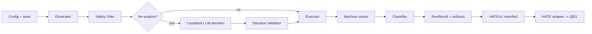

# BLUEPRINT: domain-lakda-runner

## 目的

Lakda は、ローカル環境で Chromium のブラウザテストを再現可能に実行し、機械判定可能な実行結果と HATE/v1 artifact manifest を残す。決定的な通常テストを基盤とし、ローカル LLM は独立した `llm-explore` モードで候補操作の選択を補助する。

## 解く課題

- ブラウザ操作、失敗、再現用 action sequence、ログを同一 run に束ねる。
- LLM の探索性を取り込む一方、任意コード・任意 URL・任意 selector の実行を許可しない。
- Lakda の run outcome と、HATE/QEG の gate verdict を混同しない。

## スコープ

### In

- Chromium の smoke、seeded-random、regression-replay、`llm-explore`。
- Generator、Executor、Collector、Classifier、HATE Exporter の最小実装。
- run metadata、action sequence、console、failure report、HATE/v1 manifest の保存。
- 失敗時 trace/screenshot、profile 指定時 video/HAR/DOM snapshot。
- OpenAI 互換の loopback LLM endpoint と strict JSON decision 契約。

### Out（post-v1）

Firefox/WebKit、route-crawl、form-fuzz、visual-sanity、動画/HARの常時保存、直接 QEG 出力、staging 監視、`doctor --fix`。

## 責務と境界

| コンポーネント | 責務 | してはならないこと |
|---|---|---|
| Generator | profile と seed から候補操作を作る | 任意 shell を生成する |
| Executor | allowlist 済み候補を実行し、機械観測を取得する | LLM文字列を直接評価・実行する |
| Collector | run 証跡と artifact を保存する | secret を平文保存する |
| Classifier | pageerror、HTTP status、timeout、状態差分を分類する | LLM 単独で pass/fail を決める |
| HATE Exporter | HATE/v1 manifest を検証・出力する | QEG record や Gate verdict を生成する |
| HATE/QEG | HATE audit と QEG 変換・Gate を担当する | Lakda の run outcome を上書きする |

## I/O 契約

### 入力

- `lakda.config.json`（base URL、browser、profile、seed、timeout、artifact policy）。
- replay 時の action sequence と、必要な auth storage state の参照。
- `llm-explore` 時の `http://127.0.0.1:8080/v1`、実モデル ID、モデル SHA-256、prompt/schema hash。

### 出力

- `.lakda/runs/<runId>/run-metadata.json`（outcome、exit code、versions、seed、timing）。
- `.lakda/runs/<runId>/action-sequence.json`（候補 ID、選択結果、実行結果、再現用順序）。
- `.lakda/runs/<runId>/console.jsonl`、`failure-report.json`、`exports/artifact-manifest.json`。
- 失敗時の trace/screenshot と profile 指定 artifact。
- 出力の `outcome` は `passed | failed | partial | error`。QEG の gate verdict は出力しない。

## 最小フロー

## 固定制約

- 実装開始時点で OS、Node.js、Playwright、HATE、QEG、LLM runtime、schema の版と Git SHA を記録する。
- LLM endpoint は loopback のみ。暗黙のモデル fallback、外部 bind、外部 URL 送信を禁止する。
- retry は接続 reset と一時的 5xx のみ最大 2 回。同一 seed、prompt、sampling で再試行する。
- すべての LLM decision は schema 検証、candidate ID allowlist、Executor の安全検査を通過させる。
- 変更単位は実装タスクごとに原則 2 source files / 100 lines 以下とし、docs-only の準備変更はこの制限の対象外とする。

## 実装単位

| ID | 内容 | 依存 |
|---|---|---|
| M0 | Workflow-cookbook 文書と受入契約を固定 | REQUIREMENTS / SPECIFICATION |
| M1 | 設定、CLI、決定的 Executor、RunResult | M0 |
| M2 | Collector、failure classifier、HATE/v1 exporter | M1 |
| M3 | loopback LLM provider と `llm-explore` safety | M1, M2 |
| M4 | replay、fake LLM 契約テスト、golden acceptance | M1–M3 |
| M5 | post-v1 の cross-browser と追加 profile | M4 の受入後 |

## 実装準備の完了条件

- 正本要件と仕様から実装境界、禁止事項、受入指標が参照できる。
- Task Seed が M1–M4 の依存順と変更範囲を固定している。
- 実装前に変更対象（source、test、CI、dependency）が未作成であることを確認できる。
- 次の実装入口は `docs/tasks/TASK.20260712-01.md` とする。

