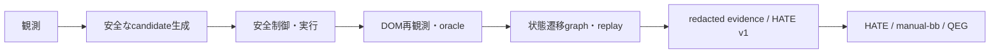

# Lakda / domain-lakda-runner

Lakdaは、Web・ゲーム・認可済みセキュリティ探索を共通の状態遷移モデルで扱うテストオーケストレーターです。Playwright、Airtest/Poco、ZAPなどの操作基盤を再実装せず、「目と手」として接続します。Lakda Coreは、安全に試す候補、踏破済み状態、再現手順、証跡を管理します。

> Lakdaのrun outcomeは最終品質Gateではありません。LakdaはHATE/v1証跡までを生成し、Go／No-Goは外部のmanual-bbとQEGが判断します。

## 機能

| 領域 | Lakdaが担うこと | 操作基盤 | 境界 |
|---|---|---|---|
| Web / SaaS | DOM・URL・通信を観測し、安全な操作候補を探索・replay | Playwright | in-process adapter |
| ゲーム | 画面・UI階層・実機入力から状態を探索 | Airtest / Poco | operator管理のloopback bridgeのみ |
| セキュリティ | 認可差分・安全な変異・手順差分を探索補助 | Security bridge / ZAP等 | 承認、scope、rate、cleanup、kill switch必須 |
| 共通コア | fingerprint、遷移graph、停止条件、oracle、replay、証跡 | adapter共通 | HATE/v1まで。QEG verdictは生成しない |



## 実装済みの機能面

| 機能 | 内容 | 入口 | ローカル実証 |
|---|---|---|---|
| 決定的実行とreplay | `smoke`、`seeded-random`、回帰replayをseed付きで再現 | `lakda run` / `lakda replay` | 済み |
| 適応型探索 | 表示・操作可能要素からcandidateを生成し、各操作後にDOMを再観測 | `lakda run --mode adaptive-explore` | 済み |
| 状態graphとcoverage | fingerprint、遷移、未探索優先、plateau停止、backtrackを記録 | adaptive run artifact | 済み |
| 安全制御と入力 | allowlist、deny操作、予算、mutation policy、kill switch、seed付き同値・境界・異常値入力 | `lakda.config.json` | 済み |
| P8 組合せ探索 | constraint-safeなpairwise／mixed-strength suiteを生成・検証 | `lakda combo gen` / `lakda combo verify` | 済み |
| P9 scouting | timeout、oracle failure、coverage gapなどをSignal／Leadへ正規化 | `lakda scout` / `lakda report leads` | 済み |
| P10 調査・昇格・縮約 | strict replay、reproduced-only promote、安全なfailure shrinking | `lakda investigate` / `lakda promote` | 済み |
| P11 case受入 | 承認targetでcase単位のreal acceptanceを実行・検証 | `npm run acceptance:extension:real` | runner実装済み。実targetは`pending_external` |

P8〜P11の契約は[拡張仕様書](docs/spec/lakda-extension/README.md)を正本とします。fixture成功を実環境受入へ昇格しません。

## 最短のローカル検証

```powershell
npm ci
npx playwright install chromium
npm run check
npm run acceptance:fixture
npm run acceptance:adaptive
npm run pack:check
```

この経路は、型・lint・ビルド・Playwright回帰・fixture受入・公開package境界を検証します。実サーバー、実機、実モデル、認可済みsecurity targetには接続しません。

## 使い方

### 診断とsmoke

`doctor`は読み取り専用です。許可済みのローカルまたはstaging URLだけを指定してください。

```powershell
lakda doctor
lakda run --base-url http://127.0.0.1:3000 --mode smoke --seed 1
```

実行結果は`.lakda/runs/<run-id>/`に保存されます。action sequence、console、failure report、必要に応じてtrace／screenshot、HATE/v1 manifestを確認できます。

### 適応型探索

`adaptive-explore`には、対象host、adapter、停止条件、recovery、mutation方針を明示した`lakda.config.json`が必要です。既存の決定的modeとは別契約です。

```powershell
lakda run --base-url <approved-base-url> --mode adaptive-explore --persona <persona> --seed <seed>
```

設定例、adapter capability、recovery、artifact確認は[RUNBOOK.md](RUNBOOK.md)と[適応型探索仕様](docs/spec/adaptive-exploration/README.md)を参照してください。

### 組合せ探索、scouting、調査

```powershell
lakda combo gen --factor-model <factor-model.json> --seed 1 --strength 2 --case-budget 50 --out <suite.json>
lakda combo verify --factor-model <factor-model.json> --suite <suite.json> --out <coverage.json>
lakda scout --config <lakda.config.json> --suite <trace-or-suite.json> --scout-mode rule-only --out <leads.json>
lakda investigate --lead <lead.json> --reviewer <reviewer-ref> --out <investigation.json>
lakda promote --investigation <investigation.json> --kind trace --out <promotion.json>
```

factor modelは安全なfixture値と専用constraint DSLだけを受け入れます。scoutはrule-firstであり、LLMが使える場合でも提示済みLead IDの選択または停止だけが許されます。`promote`はstrict replayで再現済み、かつartifact／oracle参照が揃う場合だけ成功します。

## 安全性と証跡

- 操作はallow host、deny操作、mutation種別、操作予算、kill switchの検査後にだけ実行します。
- Airtest/PocoとSecurity bridgeは、Lakdaが外部processを起動せず、operator管理のloopback endpointにだけ接続します。
- Security機能は認可済み環境の補助です。本番への攻撃的scan、無承認mutation、LLMだけによる脆弱性認定は行いません。
- artifactはredaction、secret/PII scan、容量判定、SHA-256、HATE/v1 exportを通します。raw prompt、認証情報、storageState、実入力値を公開証跡へ含めません。
- mock、fixture、状態注入は補助証跡です。実サーバー・実機の受入証跡とは区別します。

## 受入とリリースの状態

| 区分 | 状態 | 意味 |
|---|---|---|
| P8〜P10ローカル機能検証 | 実施済み | 決定性、coverage、fail-closed、replay、promotion、redactionをfixtureで検証 |
| P11 real acceptance runner | 実装済み | 承認情報が欠ける場合、target接続前に`pending_external`で停止 |
| 実機・認可済みsecurity target・実ZAP | 未実施 | operator承認と外部環境が必要 |
| P7 real 16 AC corpus | 未実施 | immutable corpus、実target、artifact再照合が必要 |
| manual-bb / QEG final Gate | 未実施 | Lakdaの責務外。外部工程で実施 |

P7の環境変数、corpus、case report、suite verifierの証跡条件は[P7 Real Adaptive Acceptance Runbook](docs/acceptance/P7-REAL-ACCEPTANCE-RUNBOOK.md)に固定しています。P11も承認済み環境がない限り`pending_external`のままです。直近の検証と残留リスクは[リリース検証記録](docs/acceptance/AC-20260716-18.lakda-extension-release-validation.md)を参照してください。

P7/P11のrunnerとrunbookは開発・評価用であり、npm packageには含めません。

## ドキュメントの入口

| 確認したいこと | 正本 |
|---|---|
| 実行方法、環境、artifact確認、失敗時復旧 | [RUNBOOK.md](RUNBOOK.md) |
| 現行v1の要件・仕様 | [REQUIREMENTS.md](REQUIREMENTS.md) / [SPECIFICATION.md](SPECIFICATION.md) |
| 適応型探索の要件・評価 | [追加要件](REQUIREMENTS-ADAPTIVE-EXPLORATION.md) / [仕様・評価](docs/spec/adaptive-exploration/README.md) |
| P8〜P11の要件・仕様・チェックリスト | [拡張要件](docs/spec/Lakda拡張要件定義書.md) / [拡張仕様書](docs/spec/lakda-extension/README.md) |
| 設計・安全方針 | [BLUEPRINT.md](BLUEPRINT.md) / [GUARDRAILS.md](GUARDRAILS.md) |
| 受入証跡 | [docs/acceptance/](docs/acceptance/) |
| 実装計画・Task Seed | [適応型探索計画](docs/IMPLEMENTATION-PLAN-ADAPTIVE-EXPLORATION.md) / [拡張計画](docs/IMPLEMENTATION-PLAN-LAKDA-EXTENSION.md) / [docs/tasks/](docs/tasks/) |

仕様の正本は現行v1では`REQUIREMENTS.md`と`SPECIFICATION.md`、適応型探索では`REQUIREMENTS-ADAPTIVE-EXPLORATION.md`と`docs/spec/adaptive-exploration/`、P8〜P11では`docs/spec/lakda-extension/`です。参考調査資料だけを根拠に公開契約を変更しないでください。