# domain-lakda-runner 仕様書

## 1. 適用範囲

本書は `REQUIREMENTS.md` の Must 要件を実装可能な契約へ具体化する。競合時は `REQUIREMENTS.md` を優先する。v1 の実装言語は Node.js / TypeScript、browser engine は Playwright、対象 browser は Chromium とする。

固定環境は次のとおりである。

| 対象 | 固定値 |
|---|---|
| Windows | 11 Home 10.0.26200、build 26200 |
| Node.js / npm | 24.6.0 / 11.5.1 |
| Playwright | 1.61.1 |
| HATE | 0.3.0、`HATE/v1`、Git `3a4b655c2434109e230f8b862a9d5fe14f1c069e` |
| QEG | 0.2.0、Git `958fd284c3d371b3562114d1f9cba5fdc27ab7fc` |
| llama.cpp | `llama-server` 9733、build `f449e0553` |
| qwen4b | `Qwen3.5-4B-Q4_K_M.gguf`、SHA-256 `00FE7986FF5F6B463E62455821146049DB6F9313603938A70800D1FB69EF11A4` |

## 2. アーキテクチャ

`domain-lakda-runner` は次の5層で構成する。

| 層 | 責務 | 禁止事項 |
|---|---|---|
| Generator | deterministic action plan または LLM 候補集合を生成する | browser 操作、Gate 判定 |
| Executor | safety policy を通過した action だけを Playwright で実行する | LLM 出力の直接実行、allowlist 回避 |
| Collector | event、artifact、run metadata を回収しhashを計算する | outcome、Gate の独自推測 |
| Classifier | 機械 rule を評価し、LLM 補助情報を非権威データとして付与する | LLM 単独の pass/fail |
| HATE Exporter | HATE/v1 artifact manifest を生成・schema検証する | audit record、QEG record、gate verdict の生成 |

```mermaid
flowchart LR
    CLI["lakda CLI"] --> ORCH["Run Orchestrator"]
    ORCH --> GEN["Generator"]
    GEN --> SAFE["Pre-execution Safety Filter"]
    SAFE --> EXEC["Playwright Executor"]
    SAFE --> LLM["Local LLM (llm-explore only)"]
    LLM --> VALIDATE["Decision Validator"]
    VALIDATE --> EXEC
    EXEC --> COL["Collector"]
    COL --> CLS["Machine Classifier"]
    CLS --> HEX["HATE Exporter"]
    HEX --> HATE["HATE/v1 artifact-manifest"]
    HATE --> HATEQ["hate export qeg"]
    HATEQ --> QEG["QEG validate / gate"]
```



LLM は `llm-explore` でのみ action selection に参加する。deterministic mode では Generator が plan を実行前に確定する。

## 3. 設定契約

既定設定ファイルは repository root の `lakda.config.json` とする。CLI option は同名の設定値を上書きする。環境変数は secret と endpoint のみ許可し、一般設定の暗黙上書きには使用しない。

```json
{
  "schemaVersion": "lakda/v1",
  "baseUrl": "http://127.0.0.1:3000",
  "mode": "smoke",
  "browser": "chromium",
  "seed": 4219,
  "persona": "guest",
  "durationMs": 600000,
  "maxActions": 100,
  "workers": 2,
  "outputDir": ".lakda/runs",
  "safety": {
    "allowHosts": ["127.0.0.1", "localhost"],
    "denyActionKinds": ["delete", "deactivate", "billing", "transfer"],
    "maxActionsPerMinute": 60,
    "requireFixtureResetForMutations": true
  },
  "llm": {
    "enabled": false,
    "baseUrl": "http://127.0.0.1:8080/v1",
    "expectedModelId": "Qwen3.5-4B-Q4_K_M.gguf",
"modelSha256": "00FE7986FF5F6B463E62455821146049DB6F9313603938A70800D1FB69EF11A4",
    "modelPath": "C:\\Users\\ryo-n\\Qwen3.5-4B-Q4_K_M.gguf",
    "runtimeEvidence": {
      "runtimeVersion": "llama-server 9733",
      "runtimeBuild": "f449e0553",
      "chatTemplateHash": "configured-at-run-time"
    },
    "seed": 4219,
    "temperature": 0,
    "topP": 1,
    "maxTokens": 512,
    "connectTimeoutMs": 5000,
    "requestTimeoutMs": 60000,
    "maxRetries": 2
  },
  "artifacts": {
    "classification": "internal",
    "trace": "retain-on-non-pass",
    "screenshot": "retain-on-non-pass",
    "video": false,
    "har": false,
    "domSnapshots": false,
    "maxRunBytes": 1073741824
  }
}
```

制約は次のとおりである。

- `mode=llm-explore` では `llm.enabled=true` を必須とする。
- `baseUrl` の host は `safety.allowHosts` に含まれなければならない。
- `workers` は1〜4、`maxActions` は1以上、`durationMs` は1以上とする。
- `maxRetries` の上限は2とし、0〜2だけを許可する。
- LLM endpoint は `127.0.0.1` または `localhost` の loopback に限定する。
- `llm.modelPath` はローカルの読み取り可能なGGUFを指し、`llm-explore`前にLakdaがSHA-256を計算して`modelSha256`と照合する。
- secret は設定ファイルへ直接記載しない。

## 4. CLI と公開型

### 4.1 CLI

| コマンド | 必須入力 | 結果 |
|---|---|---|
| `lakda run` | `--base-url`、`--mode` | 新しい run を実行する |
| `lakda replay` | `--input`、`--base-url` | 保存済み action sequence を再生する |
| `lakda export hate` | `--run-dir`、`--out` | HATE/v1 artifact manifest を再生成・検証する |
| `lakda doctor` | なし | runtime、browser、config、auth、LLM疎通を読み取り専用で診断する |
| `lakda auth capture` | `--persona`、`--browser chromium` | storageState を ignore 対象へ保存する |
| `lakda auth validate` | `--persona`、`--base-url` | storageState の有効性を読み取り確認する |

v1 にQEG直接出力subcommandと `lakda doctor --fix` は存在しない。`doctor` の LLM 確認は listener、`/v1/models`、32 tokens 以下の小さな completion までとし、品質評価には使用しない。

### 4.2 公開型

```ts
type RunMode =
  | "smoke"
  | "seeded-random"
  | "regression-replay"
  | "llm-explore";

type RunOutcome = "passed" | "failed" | "partial" | "error";

type RunOptions = {
  baseUrl: string;
  mode: RunMode;
  browser: "chromium";
  seed: number;
  persona: string;
  durationMs: number;
  maxActions: number;
  workers: number;
  outDir: string;
};

type RunResult = {
  runId: string;
  attempt: number;
  outcome: RunOutcome;
  exitCode: 0 | 1 | 2;
  artifactManifestPath?: string;
  actionSequencePath?: string;
  failures: Array<{
    failureId: string;
    ruleId: string;
    severity: "warning" | "failure";
  }>;
  llmStatus: "not_requested" | "available" | "unavailable" | "mismatch";
};

type LlmDecision =
  | {
      decision: "action";
      candidateId: string;
      inputProfileId?: string;
      reason: string;
      confidence: "low" | "medium" | "high";
    }
  | {
      decision: "stop" | "hold";
      reason: string;
      confidence: "low" | "medium" | "high";
    };
```

## 5. 実行モード

### 5.1 deterministic mode

`smoke`、`seeded-random`、`regression-replay` は実行開始前に完全な action plan を保存する。

- 候補は action kind、accessible role/name、正規化URL、安定IDの順でsortする。
- 乱数は単一のseeded RNGから取得する。
- timestamp、worker completion順、network応答順を乱数選択へ使用しない。
- worker seed は `baseSeed + workerIndex` とする。
- 実行時に解決した target と URL は action sequence に追記するが、元planは変更しない。

### 5.2 `llm-explore`

1 action ごとに次を行う。

1. Executor が現在URL、主要な可視 role、前回action、機械failure、未達riskを機械要約する。
2. Generator が実行可能な候補へ安定IDを付ける。
3. Safety Filter がallow host、deny action、rate limit、resource limitに反する候補を削除する。
4. 候補IDと要約だけをLLMへ送る。trace、HAR、cookie、secret、raw DOM全体は送らない。
5. responseをJSON parseし、下記schemaで検証する。
6. `action` は提示済みcandidateに一致するときだけ実行する。`stop` は終了条件を評価し、`hold` はrunを `partial` で終了する。
7. 実行結果をartifactへ追記し、次actionへ進む。

終了条件は、`maxActions` 到達、`durationMs` 到達、critical machine failure、候補0件、`hold`、または obligations 達成後の `stop` とする。`stop` 時に obligations が未達なら `partial`、達成済みかつfailureなしなら `passed` とする。

### 5.3 LLM decision schema

```json
{
  "$schema": "https://json-schema.org/draft/2020-12/schema",
  "$id": "https://local.invalid/lakda/v1/llm-decision.schema.json",
  "oneOf": [
    {
      "type": "object",
      "required": ["decision", "candidateId", "reason", "confidence"],
      "additionalProperties": false,
      "properties": {
        "decision": { "const": "action" },
        "candidateId": { "type": "string", "minLength": 1 },
        "inputProfileId": { "type": "string", "minLength": 1 },
        "reason": { "type": "string", "minLength": 1 },
        "confidence": { "enum": ["low", "medium", "high"] }
      }
    },
    {
      "type": "object",
      "required": ["decision", "reason", "confidence"],
      "additionalProperties": false,
      "properties": {
        "decision": { "enum": ["stop", "hold"] },
        "reason": { "type": "string", "minLength": 1 },
        "confidence": { "enum": ["low", "medium", "high"] }
      }
    }
  ]
}
```

schema不正、未提示candidate、モデル不一致は実行基盤エラーとして `outcome=error`、exit code 1 とする。

## 6. LLM provider 契約

### 6.1 preflight

`llm-explore` 開始前に次を順番に検査する。

1. endpoint がloopbackである。
2. 5秒以内にTCP接続できる。
3. `GET /v1/models` が成功する。
4. response内のmodel IDが `expectedModelId` と完全一致する。
5. model fileのSHA-256が固定値と一致する。
6. 32 tokens以下の `POST /v1/chat/completions` が20秒以内に成功する。
7. action decision requestにstrict JSON responseを要求できる。

preflight は疎通確認であり、AC-007〜AC-010 の品質受入を代替しない。

### 6.2 generation

| 項目 | 既定値 |
|---|---:|
| temperature | 0 |
| top_p | 1 |
| max_tokens | 512 |
| seed | run seed |
| connection timeout | 5秒 |
| generation deadline | request開始から60秒のhard total deadline |
| retry | 初回に加えて最大2回（最大3 attempt） |
| context upper bound | 8,192 tokens |

retry対象はconnection resetとHTTP 500/502/503/504だけに限る。generation deadline到達、clean EOF、壊れたSSE、HTTP 4xx、schema不正、semantic failure、model mismatchはretryしない。retryは同じprompt、schema、seed、sampling値を使用し、1秒、2秒のbackoffを置く。TTFTはstream内で最初の非空content deltaを受信した時点から測定する。別endpointまたは別modelへのfallbackは禁止する。

### 6.3 LLM証跡

各requestで次をJSONLへ保存する。

- endpoint、model ID、model SHA-256
- llama-server version/build、backend、thread/GPU設定
- chat template hash、prompt hash、schema hash
- seed、temperature、top_p、max_tokens
- request/response token数、TTFT、total latency
- attempt、retry reason、HTTP status
- 生response bytesのSHA-256と、保存するredaction済みrequest/response bytesのSHA-256（本文は保存しない）
- decision、validation結果、拒否理由

## 7. failure、outcome、終了コード

### 7.1 v1 machine rules

| Rule | 条件 | 結果 |
|---|---|---|
| UI-001 | `pageerror` | failure |
| UI-002 | browser/page crash | failure |
| UI-003 | allowlistで抑制されていない `console.error` | failure |
| UI-004 | 主要requestのstatusが500以上 | failure |
| UI-005 | 許可ルートの401/403/404 | failure |
| UI-006 | actionまたはnavigation timeout | failure |
| UI-007 | 予期しないlogout | failure |
| UI-008 | redaction、artifact hash、manifest生成の失敗 | runner error |

HTTP errorはresponse statusで判定し、network transport failureとは分離して記録する。

### 7.2 outcome対応

| outcome | 条件 | exit code |
|---|---|---:|
| `passed` | obligations達成、failureなし、artifact完全 | 0 |
| `failed` | run完了、machine failureが1件以上 | 2 |
| `partial` | 証跡は有効だがhold、上限到達、未達obligationで終了 | 2 |
| `error` | config、provider、browser、schema、artifact生成等の基盤失敗 | 1 |

`llm-explore` でLLMが不在またはmodel不一致なら `error` とする。deterministic modeではLLMを呼ばず、利用不能をmetadataへ記録して実行を継続する。

## 8. artifact と HATE

### 8.1 保存方針

| artifact | 保存条件 |
|---|---|
| `run-metadata.json` | 常時 |
| `action-sequence.json` | 常時 |
| `console.jsonl` | 常時 |
| `failure-report.json` | 常時。failureなしでも空配列を保存 |
| `artifact-manifest.json` | 完了した全run |
| `trace.zip` | `failed / partial` で必須 |
| `screenshot/*.png` | `failed / partial` で最低1枚必須 |
| video / HAR / DOM snapshot | v1ではconfig明示時のみ |

```text
.lakda/runs/<run-id>/
  run-metadata.json
  action-sequence.json
  console.jsonl
  failure-report.json
  artifacts/
  exports/
    artifact-manifest.json
```

artifactは保存前にredactionし、その後にSHA-256を計算する。hash対象は保存されたbytesとする。

### 8.2 HATE manifest例

```json
{
  "schema_version": "HATE/v1",
  "run_id": "lakda:run-20260712-001",
  "run_attempt": 1,
  "commit_sha": "0000000000000000000000000000000000000000",
  "artifacts": [
    {
      "artifact_id": "lakda:artifact-failure-report-001",
      "kind": "report",
      "path": "failure-report.json",
      "sha256": "sha256:0000000000000000000000000000000000000000000000000000000000000000",
      "size_bytes": 0,
      "classification": "internal",
      "redaction_status": "not_required",
      "redaction_rule_version": "lakda-redact-v1",
      "safe_for_summary": true,
      "public_exposure": "none",
      "retention": {
        "class": "default",
        "days": 14
      },
      "security_checks": {
        "secrets_scan": "pass",
        "pii_scan": "pass"
      }
    }
  ]
}
```

Lakdaが生成するHATE recordはartifact manifestだけである。`audit-record` はHATEのcommon envelopeを必要とし、HATEによるartifact検証後に生成する。

### 8.3 QEG境界

`lakda:*` IDはLakda runとHATE入力内だけで使用する。QEG 0.2のstable IDへ直接書き込まない。HATE adapterがQEG出力時に `hate:*` などQEG許可prefixへ変換し、変換表とsource referenceを保持する。Lakdaは `quality-evidence-record`、`test-placement-plan`、`gate-verdict` を生成しない。

## 9. セキュリティ処理

実行順は次で固定する。

1. URLとhostを正規化する。
2. allow host外を拒否する。
3. action kind、accessible name、周辺textをdeny policyへ照合する。
4. mutation actionではfixture reset hookの設定を確認する。
5. secret/PIIを機械redactionする。
6. LLM候補を生成する。
7. LLM decisionをschemaとcandidate集合で検証する。
8. ExecutorだけがPlaywright actionへ変換する。

LLM responseはデータとして扱い、`eval`、`Function` constructor、dynamic import、shell、PowerShell、`cmd.exe`、任意path読取へ渡さない。

## 10. traceability matrix

| 要件 | 仕様節 | 受入条件 |
|---|---|---|
| REQ-FN-001 | 1、4、5 | AC-002、AC-003 |
| REQ-FN-002、REQ-FN-003 | 5.1 | AC-001 |
| REQ-FN-004 | 4.1、5.1 | AC-001、AC-004 |
| REQ-FN-005 | 5.2 | AC-007〜AC-010 |
| REQ-FN-006 | 4.1、9 | AC-013 |
| REQ-FN-007 | 7.1 | AC-002、AC-003 |
| REQ-FN-008、REQ-FN-009、REQ-FN-010 | 8 | AC-005、AC-006 |
| REQ-FN-011 | 4.1 | AC-012 |
| REQ-FN-012 | 7.2 | AC-001〜AC-013 |
| REQ-LLM-001 | 3、6.1 | AC-010 |
| REQ-LLM-002、REQ-LLM-003 | 5.2、5.3、9 | AC-007、AC-008 |
| REQ-LLM-004 | 6.3 | AC-010 |
| REQ-LLM-005 | 6.2 | AC-010 |
| REQ-LLM-006 | 6.1、6.2、7.2 | AC-009 |
| REQ-LLM-007 | 7.2 | AC-011 |
| REQ-LLM-008 | 2、7、8.3 | AC-002、AC-003 |
| REQ-LLM-009 | 4.1、6.1 | AC-010 |
| REQ-SEC-001、REQ-SEC-002 | 3、5.2、9 | AC-008 |
| REQ-SEC-003、REQ-SEC-004 | 8、9 | AC-005、AC-013 |
| REQ-SEC-005 | 9 | AC-013 |
| REQ-SEC-006 | 3、5.2 | AC-008、AC-010 |
| REQ-SEC-007 | 3、9 | AC-002、AC-003 |
| REQ-NF-001 | 1、2、6 | AC-010、AC-011 |
| REQ-NF-002 | 5.1 | AC-001 |
| REQ-NF-003、REQ-NF-004 | 6.3、8 | AC-005、AC-006 |
| REQ-NF-005 | 3 | post-v1性能評価 |
| REQ-NF-006 | 6.3 | post-v1重複排除評価 |

## 11. 文書とexampleの検証条件

- 本書中のJSON code fenceはすべてJSON parserで読めること。
- HATE manifest例は固定Git SHAの `artifact-manifest.schema.json` に適合すること。
- QEGの完全record、決定権限、直接出力subcommandをLakdaの責務として定義していないこと。
- `REQUIREMENTS.md` の全REQ IDとAC IDがtraceability matrixから参照されること。
- Markdown link、heading、code fence、Mermaid blockが閉じていること。

## 12. 一次資料

- Playwright browsers: https://playwright.dev/docs/browsers
- Playwright trace viewer: https://playwright.dev/docs/trace-viewer
- Playwright authentication: https://playwright.dev/docs/auth
- Playwright Page API/events: https://playwright.dev/docs/api/class-page
- HATE schema: `C:\Users\ryo-n\Codex_dev\harness-auto-test-evidence\schemas\HATE\v1` at Git `3a4b655c2434109e230f8b862a9d5fe14f1c069e`
- QEG schema: `C:\Users\ryo-n\Codex_dev\quality-evidence-graph\schemas` at Git `958fd284c3d371b3562114d1f9cba5fdc27ab7fc`


