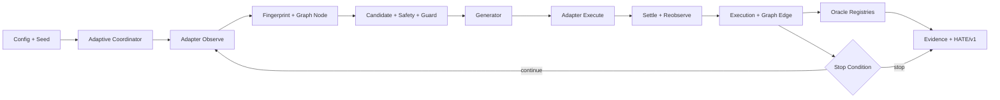

# Lakda 適応型探索 実装計画

本計画は[追加要件](../REQUIREMENTS-ADAPTIVE-EXPLORATION.md)と[6仕様書・チェックリスト](spec/adaptive-exploration/README.md)を、Workflow-cookbookのBlueprint、Task Seed、Acceptance、Runbook、Evidenceへ投影する。現行v1の`SPECIFICATION.md`と既存modeは維持する。

## Plan

### 1. コンテキスト取込

Workflow-cookbook Birdseye `generated_at=00058`から次の0-hop nodeを使用した。

| node_id | role | 使用理由 |
|---|---|---|
| `BLUEPRINT.md` | requirements | Problem、Scope、I/O、Minimal Flow |
| `GUARDRAILS.md` | policy | tests-first、互換性、2 source/100行上限 |
| `RUNBOOK.md` | operations | prepare→execute→confirm、rollback |
| `EVALUATION.md` | quality | Acceptance、KPI、test outline |
| `TASK.codex.md` | template | Task Seed必須項目 |
| `docs/IMPLEMENTATION-PLAN.md` | plan | 段階導入、依存、チェックリスト |

Lakda側は`docs/birdseye/index.json`のrequirements、specification、blueprint、policy、operations、quality、task nodeを使用する。計画追加後にCodemapを再生成し、追加要件・仕様・計画nodeを同期する。

### 2. Objective

`adaptive-explore`を既存modeから分離して追加し、Playwrightを最初のadapterとして、操作ごとの再観測、状態地図、coverage誘導、strict replay、oracle、証跡を決定的かつ安全に実装する。その受入後にAirtest/Pocoと認証済みSecurity adapterを接続する。

### 3. Scope

- In: 7共通DTO、adapter SPI、Playwright観測、fingerprint、candidate、graph、Generator/Stop、coverage、recovery、InputGenerator、strict replay、shrinking、oracle、HATE/v1投影、game/security adapter、16 AC。
- Out: 既存`seeded-random`と`lakda/action-plan/v1`の意味変更、操作engine再実装、外部process自動起動、未許可active security、LakdaによるQEG Gate確定。

### 4. 固定設計

1. `RunMode`へ`adaptive-explore`を加えるが、既存4 modeのplan/runner経路は変えない。
2. `lakda/v1` configへoptional `adaptive`を後方互換で追加し、adaptive modeだけ必須とする。
3. 動的traceは新規`lakda/adaptive-trace/v1`とし、`action-plan/v1`を拡張しない。
4. Playwrightはin-process。Airtest/PocoとZAPはoperator管理のloopback JSON serviceへ接続し、Lakdaは起動しない。
5. `src/core/runner.ts`はdispatchだけを追加し、新規ロジックは`src/adaptive/`と`src/adapters/`へ分離する。
6. Task Seedは原則0.5 engineer-day、source 2ファイルまたは100行以内。超過時は着手前に再分割する。
7. tests-first、Acceptance Record必須、対応仕様checklistのB/Cは実証跡取得後だけ更新する。

### 5. Public I/O

```text
lakda run --base-url <url> --mode adaptive-explore --persona <name> --seed <int>
lakda replay --input <action-plan-v1-or-adaptive-trace-v1.json> --base-url <url>
```

`replay`は`schemaVersion`で入力を判別し、adaptive traceはstrict replayへ送る。`adaptive` configは`schemaVersion`、adapter/capabilities、generator、stopWhen、settlePolicy、fingerprintPolicy、recovery、任意のsecurityProfileRefを持つ。seedはtop-levelだけを正本とする。

新規moduleは`src/adaptive/{contracts,coordinator,fingerprint,graph,generators,stop,coverage,replay,recovery,input-generator,shrinker,oracles,evidence}.ts`、adapterは`src/adapters/{types,playwright,game,security}`へ配置する。

新規artifactはrun directoryの`adaptive/`配下へ保存する。

| artifact | schemaVersion | path |
|---|---|---|
| observations | `lakda/observations/v1` | `adaptive/observations.jsonl` |
| candidates | `lakda/candidate-snapshots/v1` | `adaptive/candidates.jsonl` |
| trace | `lakda/adaptive-trace/v1` | `adaptive/trace.json` |
| graph | `lakda/state-graph/v1` | `adaptive/state-graph.json` |
| coverage | `lakda/coverage-report/v1` | `adaptive/coverage.json` |
| oracle results | `lakda/oracle-results/v1` | `adaptive/oracle-results.jsonl` |
| shrink report | `lakda/shrink-report/v1` | `adaptive/shrink-report.json` |

全artifactは現行Artifact Store/Policy、redaction、実bytes scan、SHA-256、HATE/v1確定順序を通す。`RunResult`は変更せずmanifestから発見する。

### 6. Minimal Flow



### 7. Task Seed map

各IDは予約済み。依存TaskのAcceptance Recordが`approved`になるまで着手しない。

| Phase | Task Seed | Objective | Affected paths | Depends | AC |
|---|---|---|---|---|---|
| P0 | `TASK.20260714-08` | 共通DTOと単一JSON Schema | `src/adaptive/contracts.ts`, `schemas/adaptive-contracts-v1.schema.json`, contract test | specs | `AC-AE-014` |
| P0 | `TASK.20260714-09` | config/RunMode feature gate | `types.ts`, `config.ts`, config schema/test | 08 | `AC-AE-004`, `AC-AE-005` |
| P0 | `TASK.20260714-10` | Adapter SPI、capability、error mapping | `src/adapters/types.ts`, adapter contract test | 08 | `AC-AE-014` |
| P0 | `TASK.20260714-11` | adaptive共通Safety Policy | `src/adaptive/safety.ts`, `src/core/safety.ts`, safety test | 08,10 | `AC-AE-016` |
| P1 | `TASK.20260714-12` | Playwright target registry | `src/adapters/playwright/targets.ts`, target test | 10 | `AC-AE-008`, `AC-AE-014` |
| P1 | `TASK.20260714-13` | Observation builderとsettle | `playwright/observation.ts`, `adaptive/settle.ts`, observation test | 12 | `AC-AE-001`, `AC-AE-008` |
| P1 | `TASK.20260714-14` | fingerprint canonicalization | `adaptive/fingerprint.ts`, fingerprint test | 13 | `AC-AE-002` |
| P1 | `TASK.20260714-15` | stable candidate、guard、stale拒否 | `playwright/candidates.ts`, candidate test | 11,13,14 | `AC-AE-001`, `AC-AE-008` |
| P2 | `TASK.20260714-16` | coordinatorとCLI dispatchの最小loop | `adaptive/coordinator.ts`, `runner.ts`, `cli.ts` | 09,10,15 | `AC-AE-001` |
| P2 | `TASK.20260714-17` | trace reducer型graphと保存 | `adaptive/graph.ts`, graph test | 16 | `AC-AE-003` |
| P2 | `TASK.20260714-18` | trace、strict replay、divergence | `adaptive/replay.ts`, replay test | 16,17 | `AC-AE-010` |
| P2 | `TASK.20260714-19` | 3 oracle registryと誤昇格防止 | `adaptive/oracles.ts`, oracle test | 08,16 | `AC-AE-012` |
| P2 | `TASK.20260714-20` | adaptive evidenceとHATE投影 | `adaptive/evidence.ts`, `core/hate.ts`, evidence test | 17,19 | `AC-AE-013`, `AC-AE-014` |
| P3 | `TASK.20260714-21` | random/weighted/least-visited | `adaptive/generators.ts`, generator test | 17 | `AC-AE-004` |
| P3 | `TASK.20260714-22` | any/all Stop、hard cap、plateau | `adaptive/stop.ts`, stop test | 11,21 | `AC-AE-005` |
| P3 | `TASK.20260714-23` | coverage分母・revision・時系列 | `adaptive/coverage.ts`, coverage test | 17,21,22 | `AC-AE-006` |
| P3 | `TASK.20260714-24` | shortest/risk-weighted capability | generator module/guided test | 23 | `AC-AE-004`, `AC-AE-006` |
| P4 | `TASK.20260714-25` | loop、backtrack、timeout recovery | `adaptive/recovery.ts`, recovery test | 17,22 | `AC-AE-007` |
| P4 | `TASK.20260714-26` | versioned InputGenerator | `adaptive/input-generator.ts`, generator test | 08,11 | `AC-AE-009` |
| P4 | `TASK.20260714-27` | Web formとInputCase接続 | `playwright/forms.ts`, form test | 15,26 | `AC-AE-009` |
| P4 | `TASK.20260714-28` | immutable failure shrinker | `adaptive/shrinker.ts`, shrinker test | 18,25,27 | `AC-AE-011` |
| P5 | `TASK.20260714-29` | loopback game protocol/fake bridge | `game/client.ts`, game schema/contract test | 10,20 | `AC-AE-015` |
| P5 | `TASK.20260714-30` | Airtest/Poco provenance/game oracle | `game/adapter.ts`, opt-in test | 19,29 | `AC-AE-015` |
| P6 | `TASK.20260714-31` | authorization、role差分、逐次mutation | `security/authorization.ts`, `mutations.ts`, auth test | 11,19 | `AC-AE-016` |
| P6 | `TASK.20260714-32` | 専用race scheduler/cleanup | `security/race.ts`, race test | 25,31 | `AC-AE-016` |
| P6 | `TASK.20260714-33` | loopback ZAP/confirmation flow | `security/zap.ts`, ZAP contract test | 20,31 | `AC-AE-016` |
| P7 | `TASK.20260714-34` | AC001-014 corpus/runner/report schema | adaptive fixtures、acceptance script/schema | 15,18,20,23,25,28 | `AC-AE-001`〜`AC-AE-014` |
| P7 | `TASK.20260714-35` | AC015/016 realとHATE/QEG接続 | real acceptance script、RUNBOOK、acceptance | 30,32,33,34 | `AC-AE-015`, `AC-AE-016` |

推定は28 Task Seed × 0.5日 = 14 engineer-days。review、実機・認証済み環境準備、QEG待機を含めない。

### 8. Phase Gate

| Phase | Exit |
|---|---|
| P0 | schema compile、fake adapter、Safety negative pass |
| P1 | AC001/002/008/014 fixture pass |
| P2 | graph再構築、strict replay、oracle/HATE投影pass |
| P3 | AC004/005/006、hard cap超過0件 |
| P4 | AC007/009/011、未許可mutation 0件 |
| P5 | AC015 opt-in real approved |
| P6 | AC016、未許可active操作0件 |
| P7 | 16 AC、HATE/v1、manual確認、QEG側Gate入力完了 |

## Patch

- core変更はconfig、dispatch、Safety/HATE接続の薄い差分だけにする。
- Taskごとにtest→implementation→Acceptance Recordを同一PRへ含める。
- P5/P6はoptional capabilityとし、backend不在をpass/fallbackで隠さない。
- rolloutはfixture-only→明示adaptive mode→opt-in game→authorized securityの順。
- rollbackはTask commitの`git revert`。artifactを削除せず、schema downgrade変換をしない。

## Tests

- Unit: canonicalization、stable ID、RNG、Generator、Stop、coverage、InputGenerator、oracle、Safety。
- Contract: JSON Schema、unknown version拒否、fake Playwright/game/ZAP、lossless error。
- Integration: Chromium DOM/frame/popup/dialog/form/timeout/replay、trace→graph、artifact→HATE。
- Opt-in real: AC015は実機、AC016は認証済み許可環境だけを本証跡とする。
- Regression: 現行55 tests、既存action-plan bytes、RunResult、HATE manifest。

各Task完了時は`docs/acceptance/AC-YYYYMMDD-xx.md`を作成し、Scope、Acceptance Criteria、Evidence、Verification Resultを必須とする。

## Commands

```powershell
npm run check:docs
npm run typecheck
npm run lint
npm run build
npx playwright test tests/adaptive
npm test
npm run pack:check
npm run check:hate
```

P7で`acceptance:adaptive`と`acceptance:adaptive:real`を追加する。HATE/v1以降の最終判定は既存HATE/manual-bb/QEGへ渡す。

## Notes

### Risks and stop conditions

| risk | 緩和 | stop |
|---|---|---|
| state explosion | volatile除外、budget、plateau | graph/artifact budget超過 |
| nondeterminism | stable sort、単一seeded RNG | 同一fixtureでselection差分 |
| stale candidate | source fingerprint、直前guard | stale実行1件以上 |
| secret/PII | 前redaction、後scan | 残存1件以上 |
| active security | authorization、passive-only、kill switch | 未許可active操作1件以上 |
| adapter drift | handshake、version、no fallback | handshake不一致 |
| evidence誤資格 | real/mock/simulated分離 | mockによるreal AC充足 |

### KPI

- requirement/checklist traceability、決定的selection、意図的divergence検出: 100%。
- stale/deny/scope外/kill switch後の実行、secret残存、mockによるreal充足: 0件。
- strict replay成功率: 85%以上。

### Follow-ups

- Task着手前にspec/checklistのstale確認を行う。
- Task完了時にAcceptance、checklist、completion record、CHANGELOGを同期する。
- Birdseyeは計画追加時と各Phase完了時に`index+caps`更新する。
- 最終Go/No-GoはLakdaではなくHATE/QEGが決定する。

---

- 逆リンク: [README.md](../README.md) / [HUB.codex.md](../HUB.codex.md)
- 最初のTask Seed: [TASK.20260714-08](tasks/TASK.20260714-08.md)
