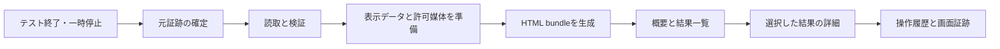

# テスト実行後レポート：詳細要件と入出力契約

## 1. 目的と初期範囲

[全体要件](20260910-detailed-requirements.md)のIMP-07を具体化する。ClaudeのArtifactのように、結果を見ながら絞り込み、選択した項目の履歴と媒体へ辿れるローカル成果物を作る。ここでのArtifactは操作可能な成果物という体験を指す。生成と閲覧にClaudeのアカウント、API、LLM処理を必須としない。以下は完成時に満たす契約であり、実装状況は[仕様索引とTaskのEvidence](../spec/verification-reports/README.md)で確認する。

初期版は概要、結果一覧、詳細、操作履歴、画像・動画、探索coverage、持ち運べるHTMLを含む。リアルタイム監視、reportからのテスト再実行、比較graph、AI要約、PDF、クラウド公開は初期範囲に含めない。

2026-09-11のユーザー指示に従い、今回の仕上げは概要・失敗理由・保存済み画像や動画を確認する基本操作と安定性に絞る。比較・開発用suite集約・レポート履歴管理は保留。Shouldは実装予定を意味せず、追加が必要になった時点で採用を改めて決める。実行内の操作履歴は既存の結果確認に使い、複数レポートの履歴管理とは区別する。

対象の「テスト」はLakdaの`smoke`、`seeded-random`、`regression-replay`、`llm-explore`、`adaptive-explore`と探索sessionを指す。`npm test`等の開発用suiteの統合は後続候補とする。これは要件案の既定値であり、利用者が個別に指定した範囲ではない。

Python bridgeの開発用試験が出すJSON／JUnitは[全体要件6.1](20260910-detailed-requirements.md#61-python検証を完了とする条件)の検証記録であり、このHTMLレポートの初期入力とは別に扱う。将来suite集約を追加する場合も、caseの成功・skip・expected failure・fixture errorをrunや操作数へ読み替えず、対応する集計契約と受入を先に定義する。

### 1.1 利用シナリオと完成条件

表示言語は日本語（`ja`、既定）と英語（`en`）を任意に選べる。`--report-language`またはレポート設定の`language`で出力時に指定する。見出し・説明・操作ラベルを切り替え、テスト由来のメッセージ・ID・コードは原文を保つ。外部翻訳サービスを必須にしない。これは既存の表示・操作性要件の具体化として扱い、[仕様の表示言語](../spec/verification-reports/SPEC-01-REPORTING.md#表示言語)と対応チェックリストで確認する。

以下は後述の要件とACを利用者の操作順で示すもので、独立した追加機能を定義しない。

| 場面 | 利用者の操作 | 確認できる結果 | 対応AC |
|---|---|---|---|
| 実行直後の確認 | 通知された保存先の`index.html`を開く | 元テストの結果、停止理由、実行範囲と未確認事項が見える。テストがfailedでもレポート生成が正常なら生成状態はready | AC-UP-012、AC-UP-014 |
| 失敗の調査 | 状態とキーワードで絞り込み、1件を選択する | message、seed、revision、実行順の履歴、関連する保存済み画像へ辿れる。対応が記録されていない媒体はrun単位と分かる | AC-UP-014、AC-UP-015 |
| 探索の中断と再開 | pause時のレポートを開き、resume後に新しいレポートを開く | それぞれの停止時点が分かり、以前のsnapshotは変わらない。findingは探索上の気づきとして表示される | AC-UP-012、AC-UP-013、AC-UP-016 |
| 途中で結果が確定しなかったrun | 保存済みrunからlocalレポートを生成する | 有効な開始記録があれば「結果未確定」。開始記録だけから実行中か異常終了かを断定せず、未取得の合否や件数を補わない | AC-UP-017 |
| 別の場所で確認 | フォルダ一式を移動し、networkなしで開く | 絞り込み・詳細・同梱媒体を利用できる。shareは媒体の検査条件と元の機密区分に従い、除外理由が分かる | AC-UP-018、AC-UP-019 |
| レポート保存の失敗 | テストを実行し、report出力先のI/O失敗に遭遇する | 元テストのstdout・終了codeは維持され、report失敗は別に通知される。途中まで書いたHTMLが完成品として現れない | AC-UP-012、AC-UP-013 |

## 2. 要件一覧

| 要件ID | 強さ | 要件 |
|---|---|---|
| REQ-UP-RPT-001 | Must | 単一run、worker batch、探索session、明示指定した複数run／sessionを入力単位とする。5 modeを扱い、同一runを重複集計しない。 |
| REQ-UP-RPT-002 | Must | 対応CLIの終了後に自動生成し、off指定と保存結果からの再生成を用意する。pause／abortも停止時点のsnapshotを生成する。targetへ再接続しない。 |
| REQ-UP-RPT-003 | Must | 本書の新規report CLIと設定を追加する。既存`report leads`、`explore report`のJSON／HTML契約を維持し、未知option、複数の排他的入力、出力先重複を明示拒否する。 |
| REQ-UP-RPT-004 | Must | 原テストoutcome／終了codeとreport生成成否を分離する。自動生成で既存stdout JSONを変えず、生成通知をstderrへ出す。独立生成CLIではreport自身の終了codeを返す。 |
| REQ-UP-RPT-005 | Must | 元run／session外へatomic生成し、既存出力を上書きしない。再生成は新report IDとし、入力digestと生成versionを保持する。 |
| REQ-UP-RPT-006 | Must | 概要に実行結果、停止理由、日時、所要時間、mode、platform、seed、run／session、producer／target revisionと実行資格を表示する。report状態・受入状態を別ラベルにする。 |
| REQ-UP-RPT-007 | Must | 確定run数、結果未確定run数、worker未完了数、failure数、finding数、action数を別集計とする。未確定runをoutcome件数へ含めない。行の表示単位と分母を明示し、actionをテストcase数として表示しない。 |
| REQ-UP-RPT-008 | Must | 状態・platform・mode・severity・キーワードによるAND絞り込み、安定した並べ替え、全解除、該当0件表示を提供する。選択と詳細表示を連動させる。 |
| REQ-UP-RPT-009 | Must | 詳細に保存済みmessage、rule／oracle、観測日時、関連ID、seed、参照証跡を表示する。failure、warning、exploratory-finding、再現確認済みの昇格recordを区別し、存在しない再現手順を生成しない。 |
| REQ-UP-RPT-010 | Must | 操作履歴と関連screenshot、video、sampled framesを表示する。証跡対応がない場合はrun単位と明示し、任意に直近actionへ結び付けない。欠落理由とtrace viewer案内を表示する。 |
| REQ-UP-RPT-011 | Must | coverageは元の分子・分母・定義・対象範囲を表示する。非対応／未取得を0で埋めず、複数runの異なる分母を単純平均・合算しない。 |
| REQ-UP-RPT-012 | Must | 元のHATE manifest、schema、参照境界、size／SHA-256、run／revision bindingを再検証する。sessionはevent hash chain・projectionと参照run HATEも照合する。入力の修復・再exportを行わない。manifestが存在しない単一runだけは第7節の開始記録による最小診断を許容し、検証済みrunとは区別する。 |
| REQ-UP-RPT-013 | Must | 正常、資料不足、改竄、未知version、実行中snapshot、出力失敗を区別し、本書の状態表どおり扱う。検証失敗を単なる非表示にして正常reportを作らない。 |
| REQ-UP-RPT-014 | Must | `local`／`share`別に媒体の表示条件を適用する。profile、機密区分、除外媒体数と理由を画面・manifestへ記録する。shareであることから公開可を意味させない。 |
| REQ-UP-RPT-015 | Must | HTMLとassetsを移動後も`file://`から開け、外部通信なしで絞り込み・詳細・媒体表示を使える。外部font、CDN、analytics、service worker、localhost serverを必要としない。 |
| REQ-UP-RPT-016 | Must | versioned view model、生成receipt、bundle manifestと入力digestを保存する。出力bytesを確認できる独立verify CLIを提供し、reportに含めた部分と元run全体の検証範囲を区別する。 |
| REQ-UP-RPT-017 | Must | 未信頼のmessage・名前・URL・logを文字として表示する。入力からscript・event handler・実行URLを組み立てず、script境界を壊さないserialization、path検証、生成後scanを行う。 |
| REQ-UP-RPT-018 | Must | raw DOM、storageState、入力値、raw prompt、秘密値をreportへ含めない。retentionと画像マスク規則を引き継ぎ、元の保持対象外媒体を取得し直さない。 |
| REQ-UP-RPT-019 | Must | 本書の件数・容量・時間上限を検証し、大量データを黙って切り捨てない。動画は遅延読込、hash計算はstreamingを基本にし、全媒体をメモリ展開しない。 |
| REQ-UP-RPT-020 | Must | 日本語表示、色以外の状態ラベル、キーボード操作、focus復帰、長文折返し、狭い画面への対応を備える。日付のtimezoneと欠落値を明示する。 |
| REQ-UP-RPT-021 | Must | 対応mode・profile・異常入力・package経由・offline・画面表示の受入を行い、実結果を記録する。ヘッドレス契約テストだけで人間の読みやすさを合格にしない。 |
| REQ-UP-RPT-022 | Should | 前回比較と対話graphは保留。改めて採用した場合は既存比較器を利用し、非互換fingerprint／graph version、対象範囲差を明示する。 |
| REQ-UP-RPT-023 | Should | AI要約、PDF／単一HTML／ZIP、開発用suite集約は保留。改めて採用する場合は独立要件を定義する。AI導入時も観測事実と推測を区別し、outcome／QEGを変更しない。 |

## 3. 利用フローと画面構成



| 画面領域 | 表示するもの | 操作・表示規則 |
|---|---|---|
| ヘッダー | report名、生成日時、profile、機密区分、生成状態 | localは「ローカル確認用」、shareは「共有用・区分に従って取扱い」。QEG未取得は別表示 |
| 概要 | passed／failed／partial／errorの確定run数、結果未確定run数、worker未完了、failure／finding、実行時間範囲 | 確定run0件は「確定した実行結果なし」。未確定runがあれば別に表示し、未取得を0件や成功に置換しない。既知のcase集合がない入力に合格率を作らない |
| 結果一覧 | run／worker／sessionに属するfailure・finding・停止情報 | 初期順はerror、failed、partial、passed、同値は時刻→安定ID。severityは元データの範囲で表示 |
| 詳細 | message、rule／oracle、参照、seed、revision、確認状態 | 行選択で更新。閉じると元の行へfocus復帰 |
| 時系列 | action／session event、時刻、観測・停止点 | 元sequenceがある場合は時刻より優先。同時刻を任意に並べ替えない |
| 媒体 | screenshot拡大、動画controls、frame一覧、trace案内 | autoplayなし。video timeとの対応が記録されている場合だけseek連携 |
| 探索範囲 | state／transition／coverage、未探索項目、制限 | mode非対応は「対象外」、欠落は「未取得」。unknown-screen等を解消済み扱いにしない |
| 根拠・未確認事項 | 入力digest、生成version、実行資格、受入blocker、除外媒体 | ID／digestをコピー可能。絶対pathやraw環境識別値を出さない |

「結果」はrunの結果、「failure」は機械ruleで記録された失敗、「finding」は探索上の気づきである。result一覧にfindingがあるだけでrun outcomeをfailedへ変更しない。昇格recordがあっても、その参照元と適用revisionを表示する。

2026-09-11のUI調整では白基調とし、概要の主要件数と結果一覧を先に読めるよう余白を整える。操作件数・実行時間などの補足情報は概要内で開閉し、結果未確定run・未完了workerの存在は常に示す。一覧の保存メッセージは2行まで表示し、詳細では全幅で全文を確認できる。詳細の閉じる操作はスクロール中も使え、日英共通で狭幅・キーボード操作・focus復帰を維持する。具体的な実装境界は[SPEC-01](../spec/verification-reports/SPEC-01-REPORTING.md)に従う。

集計はrun ID＋attempt、failureは所属run＋failure ID、findingは所属session＋finding IDを単位に重複排除する。識別子が必要なschemaでIDが欠ける場合は入力不正とする。producerのcommit SHAと対象app／Webのrevisionは別表示とし、後者が不明でも前者で代用しない。coverage分母0は`0/0・評価対象なし`、比率はnullとする。複数runの実行時間は「最初の開始〜最後の終了」と「記録された実行時間の合計」を分け、pause時間や並列時間を黙って混ぜない。

### 3.1 表示例から確認する受入条件

次の値は説明用の人工入力であり、実行結果・実測値ではない。受入時には同じ関係を持つfixtureを用意し、元データと表示を照合する。

| 入力・操作 | 期待する表示・動作 | 対応AC |
|---|---|---|
| 確定runが2件で、passed 1件・failed 1件。failedにfailure 1件、保存済み操作3件があり、他の必須入力も検証済み | runは2件、passed 1件・failed 1件、failure 1件。failedの詳細には実行済み操作3件を表示する。レポート生成状態はreadyで、テスト全体を成功と表示しない | AC-UP-012、AC-UP-014 |
| 上記からfailedだけに絞る | 一覧は該当行だけになる。元のrun総数と絞り込み後の表示件数を混同しない。全解除で元の一覧へ戻る | AC-UP-014 |
| failedの画像がrunにだけ対応し、特定の操作IDは記録されていない | runの証跡として画像を表示し、3番目の操作の画像などと推定しない | AC-UP-015 |
| 同じ結果をshareで生成し、画像には検査完了の証明がない | 画像を同梱せず除外理由を表示する。選択profileによる除外だけならreadyを維持し、媒体を検証済みと表示しない | AC-UP-018 |
| 2件の確定runに、有効な開始記録だけのrunを1件追加してlocalで生成する | 確定run 2件と結果未確定run 1件を別表示する。未確定分の合否・操作数・failure数は未取得。生成状態はdegradedとなり、standaloneの終了codeは2 | AC-UP-014、AC-UP-017 |
| 元テストはfailedで終了し、その後レポートの保存に失敗する | 元テストのstdout・終了codeを保持する。生成失敗を別通知し、未完成HTMLを完成品として公開しない | AC-UP-012、AC-UP-013 |

### 3.2 項目と媒体の対応

ここでの「項目」はfailure・findingまたは履歴の1件を指す。媒体一覧の所属runと、特定項目への対応は別に持つ。初期版は次の条件を満たす。

| 保存済み入力の状態 | 期待する扱い | 生成状態への影響 |
|---|---|---|
| 項目に明示参照があり、所属source内の媒体へ一意に照合できる | 項目から該当媒体を開ける。同じ画像が複数項目に明示参照されていれば、それぞれから開けるが媒体件数は1件 | 影響なし |
| 媒体はあるが項目との対応記録がない | 「実行全体の証跡・項目との対応記録なし」と表示。近い時刻・ファイル名・連番・最後の失敗位置から対応を作らない | 対応記録がないことだけではdegradedにしない |
| 明示参照はあるが、対応表が保存されていない、参照先が保持されていない、または複数候補が残る | 「対応する証跡を確認できません」と表示し、該当媒体を推定しない。元の合否は保持 | warningを付けdegraded |
| 参照先が検証済みtext等で、表示対象の画像・動画ではない | 媒体なしを示す。元のrule／oracle等の公開可能な参照は保持 | 表示対象外であることだけではdegradedにしない |
| 媒体との対応は確認できたがshare／text-only等で除外する | 対応項目から除外理由を確認できる。表示できる媒体数と除外数を分ける | 選択profileによる除外だけなら影響なし |
| restrictedの記録・媒体を含む | 内容・元path・元ID・他項目との対応を公開せず、制限理由だけを示す | 既存のrestricted入力規則に従う |
| 保存済みのpath・size・SHA-256が参照と食い違う | 入力不整合として拒否。別の画像を代用しない | error、成功HTMLなし |

sessionのfindingから子runの媒体を参照する場合は、検証済みsession→run参照と、そのfindingのoracle参照を使う。同じレポートに他のrunが含まれるだけでは対応の根拠にしない。異なるrunの同一IDや同一bytesを自動で統合しない。媒体の署名検証に成功しても、項目との対応を証明したとは扱わない。

既存のadapter証跡IDとHATE artifact IDは一致するとは限らない。対応には、既存の完全な証跡参照に記録されたpath・size・SHA-256とHATE snapshotを照合した結果、または同じsource内で一意なHATE IDの明示参照を使う。IDに埋め込まれた文字列からpathやdigestを逆算しない。正確な内部解決規則は[SPEC-01](../spec/verification-reports/SPEC-01-REPORTING.md)の「項目と媒体の参照解決」に従う。

### 3.3 詳細画面の操作

1. 一覧の行をクリックまたはEnter／Spaceで開く。表示対象のID・種別・結果・messageを見出し側に残し、詳細を閉じると元の行へfocusを戻す。
2. finding・failureの詳細では「この項目の証跡」と「実行全体の証跡」を区別する。対応がない場合も後者へ進める。run／workerの詳細では、そのrunの媒体を対応の有無にかかわらず一覧できる。sessionでは自身の媒体と検証済み子runの媒体の所属を表示する。
3. 履歴に対応媒体があれば「証跡を見る」と件数を表示する。選択後は履歴のsequence・labelを明示し、該当媒体へ絞る。除外媒体だけの場合も理由を確認できる。選択解除で元の媒体一覧へ戻る。
4. 画像は拡大して確認できる。狭い画面でも原寸以上の画像を画像枠内でスクロールでき、全画面を横にはみ出させない。拡大時は画像枠へfocusを移し、矢印キーで移動できる。縮小時は枠に収まる表示へ戻し、拡大buttonへfocusを戻す。動画は利用者が再生し、画像を開く操作では再生を開始しない。操作IDと動画時刻の明示対応がない場合は、履歴選択でseekしない。同じ詳細内では動画の再生位置を保持し、媒体を非表示にするときと詳細を閉じるときは一時停止する。再表示で自動再生しない。
5. 詳細内の媒体選択・解除では一覧のfilter・並び順・pageを維持する。詳細を閉じてから再度開いたときは、前の履歴選択を引き継がず、その行の既定表示に戻る。キーボード操作と390px幅／200% zoomでも選択中の項目・戻る操作を確認できる。

次はAC-UP-015／AC-UP-020へ含める人工入力の受入例であり、実測結果ではない。

| 例 | 入力・操作 | 期待結果 |
|---|---|---|
| MEDIA-01 | 履歴#2とfinding Aが画像Pを明示参照し、画像Qには項目参照がない | #2とAからPを開ける。runの一覧にはP・Qの2件があり、Qを#2へ結び付けない |
| MEDIA-02 | AからPを開き、詳細を閉じる。filter適用済み一覧からAを再度開く | filter・並び順・pageが保たれ、元の行へfocusが戻る。Aの既定詳細を表示する |
| MEDIA-03 | Aの参照IDが別runの媒体IDとだけ一致する | Aの証跡として表示しない。対応未確認とwarningを示す |
| MEDIA-04 | Aの明示参照に一致する候補が複数runにある | 任意の1件を選ばず対応未確認。runごとの媒体一覧は維持する |
| MEDIA-05 | Aに対応するPは未検査。localからshareに再生成する | localでは未検査の明示付きでPを開ける。shareではPを同梱せず、Aから除外理由を確認できる |
| MEDIA-06 | 履歴#2から動画Vを選ぶ。動画時刻との対応記録はない | Vのcontrolsを表示するが、再生・seekを自動で行わない |

### 3.4 画像・動画が表示されない場合の説明

空の画像枠だけを残さず、保存済みの記録から確認できる理由を日本語で表示する。利用者が次に確認できる場所を添えるが、レポートから撮影・検査・テストを開始しない。REQ-UP-RPT-009〜010、013〜015、018を具体化し、AC-UP-015／017／018で確認する。

| 確認できた理由 | 表示例と次の確認先 | report状態 |
|---|---|---|
| 元の保持設定による非保持 | 「実行設定により保存されていません」。該当する保持条件を表示し、撮影失敗と区別する | 他の必須入力が揃えばready |
| shareの検査条件、text-only、機密区分による除外 | 「このレポートの出力条件により除外されています」。適用した条件を表示する。restrictedでは元path・ID・内容を開示しない | profileによる除外だけならready。元入力の不足は第7節で判定 |
| 検査待機の期限切れ、停止、または媒体採用の失敗 | 「媒体を採用できませんでした」と、検証済みの最終記録にある理由を表示する。署名応答の受領だけで「検査済み画像」としない | 必須記録が揃う診断reportはreadyにできる。元runのerrorは維持 |
| 項目への明示参照を解決できない | 「この項目に対応する証跡を確認できません」。所属を確認できる実行全体の証跡へ進める | warningを付けdegraded |
| bytesは検証済みだが動画を再生できない | 「この閲覧環境では再生できません」。出力条件を満たし同梱した媒体だけ保存先を案内する | 再生可否と生成時検証を区別。暗黙の変換・再取得はしない |
| 元の参照・size・digestが一致しない | 生成を拒否し、生成receiptに不整合理由を記録する。別の媒体を表示しない | error、完成HTMLなし |

理由を確定できない場合は「未確認」とし、撮影なし・検査不合格・ファイル削除のいずれかを推定しない。媒体対応が記録されていないだけなら、実行全体の証跡として扱う。未確定runでは第7節の最小診断だけを使い、private stagingを読んで画像や失敗理由を補わない。

## 4. CLIと設定の提案契約

### 4.1 保存結果から生成

```text
lakda report generate --run-dir <run-dir> --out <new-report-dir> [--profile local|share] [--text-only]
lakda report generate --session <session-dir> --out <new-report-dir> [--profile local|share] [--text-only]
lakda report generate --sources <report-sources.json> --out <new-report-dir> [--profile local|share] [--text-only]
lakda report verify --report-dir <report-dir>
```

`--run-dir`、`--session`、`--sources`は厳密に1つ。standalone generateのprofile既定も`local`。`--out`は未存在directoryを必須とし、入力directoryと同一・内側・祖先の関係にある出力を拒否する。上書き・prune・自動open optionは初期版に設けない。

`lakda/report-sources/v1`はoperator向け入力で、`root`と`entries`を持つ。rootは入力ファイル基準または明示的な絶対path、entryは`kind=run|session`とroot内相対pathを持つ。entryの絶対path・親移動・root逸脱を拒否する。schema検証後に実pathとsource IDを再照合し、同一ID／異なるdigestを拒否する。同一ID／同じdigestは1回だけ集計し重複除去数を記録する。

worker batch自動生成では実際の`RunBatchResult`を入力にする。run directory作成前に失敗したworkerもstatus=errorのまま表示し、子run欠落をpassed扱いにしない。再生成に必要なbatch構成とsanitized worker errorは、run外のprivate source indexへ保存する。portable bundleへその絶対pathを持ち込まない。

### 4.2 自動生成

対象CLIは`run`、`replay`、`explore run`、`explore resume`。追加flagは`--report html|off`、`--report-dir <output-root>`、`--report-profile local|share`とする。既定は`html`、`.lakda/reports`、`local`。新しいreport設定はCLI後処理側へ置き、targetのconfig digest、Charter署名、candidate選択に混ぜない。

設定の優先順位は明示CLI＞CLI用report設定＞既定値。[SPEC-01](../spec/verification-reports/SPEC-01-REPORTING.md)で定めたCLI専用の`lakda.report.json`を使い、`--report-config <file>`で明示指定できる。schemaは`lakda/report-config/v1`、項目は`schemaVersion`、`auto`、`outputRoot`、`profile`、`timeoutMs`、任意の`trustStorePath`とし、未知項目を拒否する。既定fileがない場合は既定値を使い、明示指定したfileがない場合は入力errorとする。既存の`lakda.config.json`へ必須項目を追加しない。

設定file内の相対pathはそのfileのdirectory、CLIで指定した相対pathは実行時のcwdを基準にする。`trustStorePath`は利用者が指定する媒体署名検証用の鍵一覧であり、run内の保存情報から暗黙に採用しない。設定の詳細な読取・検証条件はSPEC-01を正本とする。

| 状況 | 自動生成の扱い |
|---|---|
| 通常run／replayのpassed・failed・partial・error | 元artifact finalization後に1 bundle |
| worker batch | 全worker終了後に1 bundle。childごとの自動生成は抑止 |
| session completed／aborted／paused | session event・JSON report・HATEの確定後に1 snapshot bundle |
| resume後の停止 | 新report IDで生成。過去snapshotを変更しない |
| pause／kill／bookmark要求を送るだけのCLI | reportを生成しない。runnerが状態を確定した時に生成 |
| 設定検査中などsource ID作成前の失敗 | 自動生成を行わず既存error経路を維持 |
| process強制終了 | 即時生成を保証しない。保存済み結果から後で診断生成可能 |
| `--report off`／ライブラリAPI | 生成しない |
| full fixture／実LLM fullの大量child runs | 自動生成のないlibrary APIを使う。CLIでchildを起動する場合は明示offを渡す。録画off方針も維持。親結果から必要なrun集合を別途指定可能 |

### 4.3 stdout・終了code

自動生成は既存のRunResult／RunBatchResult／session stdoutのshapeと意味を変えず、JSONへHTMLや通知文を追加しない。原テストexit 0／1／2を維持する。stderrへreport ID・保存先・生成状態を通知し、同じ内容の生成receiptをrun外へ保存する。既存結果の出力後に生成を行っても、process終了は有界な生成処理の終了を待つ。

standalone generateのstdoutはversioned receipt JSONだけとし、exit 0はreport ready、exit 2はdegraded／入力拒否、exit 1はI/O／内部生成error。元runがfailedでも完全なreportならexit 0である。verifyはbundle schema／path／bytes／digest整合にexit 0、検証不合格にexit 2、I/O／内部errorにexit 1を返す。verifyは原テストを再検証・再実行しない。

## 5. データ契約と保存構造

入力はHATEで参照検証されたmetadata、failure-report、action-sequence、adaptive trace／graph／coverage、session events／findings／report、関連媒体を使う。表示用データは許可fieldを選択して構築する。入力JSONを丸ごとHTMLへ埋め込まない。

| 契約 | 主なfieldと規則 |
|---|---|
| `lakda/report-view/v1` | report ID、profile、source参照、run／worker結果、findings／failures、timeline、coverage、媒体一覧、問題一覧、counts、display timezone。絶対pathなし |
| `lakda/report-receipt/v1` | report ID、generationStatus、profile、source IDs、issues、output相対参照、生成時間、producer。生成失敗も秘密値を除いて記録 |
| `lakda/report-bundle-manifest/v1` | schema／producer version、入力manifest digest、source IDとrevision、出力fileのpath・size・SHA-256、機密区分、検証時刻・範囲、除外理由。自己hashは含めない |
| `lakda/run-start/v1`（未確定runの診断入力） | run ID／attempt、開始UTC、mode、seed、worker index、任意batch ID、producer version／revision、機密区分。target接続前に保存し、保存失敗時はtargetへ進まない。合否・終了理由・URL・端末識別値・raw errorを含めない |
| `lakda/report-batch-sources/v1`（private source index） | 再生成元path、全workerの元status／seed、成立runのID／attempt／digest、sanitized error。portable bundle外で管理。詳細は[SPEC-01](../spec/verification-reports/SPEC-01-REPORTING.md) |

生成物は`index.html`、ローカルCSS／JS、`report-data.json`、`report-manifest.json`、`assets/`で構成する。HTMLから`fetch(file://...)`を必須にせず、埋込済みの安全なview modelで起動する。JSONと埋込view modelは同じcanonical projectionから作り、生成時に一致を検査する。

manifestは自身以外の全bundle fileを列挙する。manifestのdigestはbundle外receiptに記録する。出力の検証は一致性の確認であり、署名されていないbundleとmanifestが一緒に改変された場合の真正性を保証しない。画面には「生成時の入力検証」と表示し、ブラウザ表示だけで現在の元runやbundle全bytesを再検証したと主張しない。

同一入力、profile、renderer／policy version、表示設定から得る実行結果projection・件数・順序は決定的である。report ID・生成時刻・receiptは別の生成情報として差異を許容する。異なるraw入力が同じbasenameを持っても媒体pathが衝突しないよう安定したartifact IDを使う。

## 6. 媒体・共有・機密区分

| 条件 | local | share |
|---|---|---|
| 参照・bytes検証済みtext | field選択とredaction／scan後に表示 | 同じ条件で表示。元区分を引き下げない |
| public／internal／confidentialの画像・動画、scan pending | bytes検証済みの場合に限り表示可能。「未検査・共有対象外」を明示 | 同梱しない。`unverified-media`を表示 |
| 許可policy／attestorで検証された媒体 | 表示可能 | 検証済みoutputのみ同梱可能。real binaryはtarget attestor allowlistも照合 |
| restricted媒体 | 同梱しない。取扱い制限を表示 | 同梱しない |
| 元artifactにない媒体／保持対象外 | 取得し直さず理由を表示 | 同左 |
| `--text-only` | 媒体を全除外し一覧には理由を表示 | 同左 |

shareは機密区分を解除する機能ではない。出力区分は含めたsource／artifactの最大機密区分を維持し、自動uploadしない。restricted sourceからは内容を取り込まず、内容を推測できない参照と制限理由だけを表示する。必要情報が不足する場合はdegradedにする。

画像は既存の検証済みraster、動画は保存済みbrowser対応形式、sampled framesは静止画列として表示する。非対応codecは媒体fileと理由を提示し、transcodeを暗黙実行しない。SVG／HTML／HAR／raw DOMをinline previewしない。trace ZIPはlocalでのみ許可された参照と既存viewerの手順を示し、shareへは初期版では同梱しない。

## 7. 状態と異常時の扱い

`generationStatus=ready|degraded|error`とし、原テストoutcome・実行資格・受入状態から独立させる。

| 条件 | 状態／終了code | 出力 |
|---|---|---|
| 全必須入力が検証済み、選択profileの条件を満たす | ready／0 | HTML bundle。原run failedでもready |
| profileによる媒体除外、passedの既定capture非保持 | ready／0 | 件数・理由を表示。媒体がないことをテスト失敗にしない |
| 有効なrun開始記録があり、最終manifestが存在しない | local: degraded／2、share: error／2 | 「結果未確定」として最小診断のみ。開始記録だけでは実行中／異常終了を区別できない。未検証message・媒体・件数を取り込まない |
| 最終manifestも検証可能な開始記録もない | error／2 | 入力不足のreceiptのみ。directory名からrun IDを推定しない |
| optionalな履歴が既存schema上欠け、元整合は成立 | degraded／2 | 検証済み部分と欠落理由。元outcomeは保持 |
| source不存在、未知schema、入力の重複競合、件数超過 | error／2 | failure receiptのみ |
| HATE／媒体hash不一致、run binding不一致、参照逸脱、event chain不整合 | error／2 | 成功HTMLなし。複数入力でも不正sourceを黙って除外しない |
| 実行中session、同時更新を検知、未確定capture | error／2 | `source-not-finalized`。待機・再実行せず後の生成を案内 |
| 必須資料はあるがreport出力先書込不可・renderer例外・生成timeout | error／1 | 部分HTMLをfinal名で公開しない。receiptも保存不能ならstderrへ通知 |

未確定runでは開始記録のschema・日時・選択field・bytesを検証し、そのIDを用いる。開始記録のSHA-256をHATEのdigestとは別に保存する。未確定runの合否、終了時刻、所要時間、停止理由、action数、failure数は未取得とし、確定runの集計へ含めない。restrictedは内容を推測できない参照と制限理由だけを表示する。shareはrestrictedを含め未確定runを拒否する。

既存manifestの不正・破損・不正な参照を、manifest不存在として最小診断へ切り替えない。既存の正常なHATE入力は従来の参照検証契約で読む。生成完了前に開始記録のbytes・run directoryの同一性・manifest不存在を再照合し、生成中に更新された場合は公開しない。完全bundleを組み立てて検証してから出力root内でatomic renameする。作業directory名をreceiptへ残し、自動削除する場合も自分が作成した未確定出力だけに限定する。

## 8. 非機能要件と数値の提案値

| 項目 | 初期上限・目標 | 測定／境界 |
|---|---|---|
| 入力件数 | 明示sourceは1〜100、展開後run最大100 | source数0／1／100／101、重複除去後の数で検証。sourceなしは拒否。開始前abortの有効sessionはrun0件を許容 |
| 表示データ | action＋event合計10,000、failure＋finding合計1,000 | 行種別別件数を表示。上限超過はsource集合を明示的に絞るまで拒否。初期版ではrun内部の切捨てoptionなし |
| 読取上限 | structured text合計32 MiB、入力artifact合計2 GiB | 読取前に宣言量、読取中に実量を確認。超過を黙って省略しない |
| 出力上限 | view model 16 MiB、媒体1個256 MiB、bundle合計1 GiB | 超過は拒否。`--text-only`による明示的再生成を案内 |
| 生成時間 | 無媒体基準corpusで10秒以内、生成hard timeout既定120秒 | 基準機で5回測定し全結果を保存。設定範囲10〜600秒、timeoutはerror |
| 描画 | 最大件数corpusで初期操作可能3秒以内、filter更新p95 300ms以内 | media読込時間を除く。仮想化／ページ分割を許容し、全件数は保持 |
| viewer | WindowsのChrome／Edge、1366×768と幅390px | 受入時に正確なbrowser buildと機器条件を記録 |
| 操作性 | キーボードでfilter→行→詳細→閉じる、100%／200% zoom | 主要操作でfocus喪失・文字切れ・色のみ判別がない |
| timezone | 保存時刻はUTC、表示既定は元時刻のUTC、利用者が明示切替可能 | UIで現在のtimezoneを表示。所要時間は記録されたdurationを優先 |
| offline | 初期表示・filter・媒体表示中の外部request 0件 | network監視で確認。書込・target接続・process起動も0件 |

数値は仕様案としての上限・性能目標であり実測値ではない。実装前に基準機を記録し、目標を満たせない場合は測定結果と影響を添えて要件を改訂する。遅い結果を除外してpassにしない。media hash検証とコピーにはstreamingを使い、view modelの上限と媒体容量を別に扱う。

## 9. 実装境界・受入との接続

Plan: 検証reader→sanitized view model→renderer→CLI後処理の順に実装する。readerはcatalogの既存strict検証を共通化し、原artifactを変更しない。

Patch: report専用module／assets／schema／commandを追加し、元run・replayの選択ロジックを変更しない。packageへrenderer assetsを確実に含め、source checkoutがない隔離installでも生成できるようにする。

Tests: [詳細チェックリスト](20260910-detailed-checklist.md)のAC-UP-011〜021を満たす。人工fixtureの秘密値・特殊文字・欠損・不正参照は結果の表示／拒否だけを確認し、実targetへ接続しない。

Commands: 実装時に専用契約／UIテストcommandをpackageへ追加し、既存`npm run check`、`npm run test:contracts`、`npm run pack:check`と接続する。現時点では追加commandを実装済みとして記載しない。

Notes: report生成成功はテスト成功・実機受入・QEG goではない。元の終了code、媒体保持、既存`report leads`と`explore report`の出力を回帰対象に含める。
