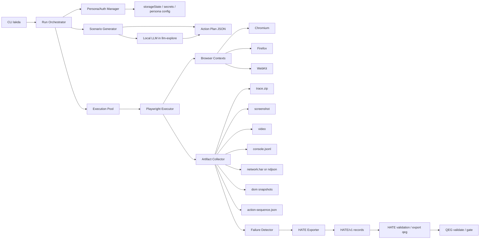
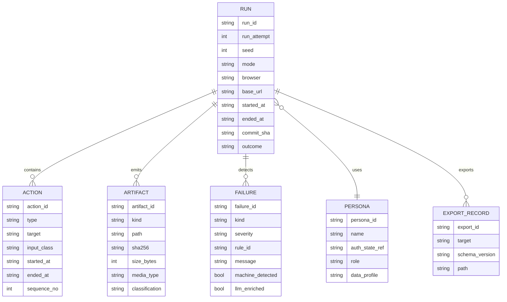
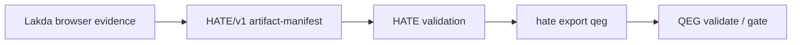

# domain-lakda-runner 技術調査報告書（参考資料）

> **非規範文書:** 本書は背景、選定理由、将来候補を保存する参考資料です。Must/Should、公開契約、schema、受入条件は [REQUIREMENTS.md](../../REQUIREMENTS.md) と [SPECIFICATION.md](../../SPECIFICATION.md) を正本とします。

## エグゼクティブサマリ

**結論として、`domain-lakda-runner` は「Playwright を実行エンジンにした local-first の探索型 E2E 証跡コレクタ」として設計するのが最も整合的です。**
理由は三つあります。第一に、Playwright は Chromium / Firefox / WebKit を単一 API で駆動でき、ローカルでも CI でも headless / headed の両方で動かせ、並列実行・トレース・動画・スクリーンショット・ネットワーク捕捉を標準機能として持っています。第二に、既存の `quality-evidence-graph` は仕様・差分・リスク・テスト配置・Gate を単一グラフで扱う local-first 基盤であり、`harness-auto-test-evidence` は runner 非依存の local-first 証跡正規化器で、`domain-lakda-runner` はその前段 collector として自然に接続できます。第三に、探索的テストは「確認」より「探索と学習」に強い。ただし正本のv1 Mustは smoke / seeded-random / regression-replay / llm-explore に限定し、route-crawl / form-fuzz / visual-sanity はpost-v1候補として扱います。

本 OSS の最小価値は、**実ブラウザをローカルで再現可能に叩き、失敗を構造化証跡として HATE/QEG に流せること**です。単なる monkey test 実行器では足りません。必要なのは、実行単位ごとに `run_id / seed / persona / browser / base_url / timestamp` を持ち、操作列・スクリーンショット・trace・console・network・DOM snapshot を保存し、deterministic modeでは機械判定し、llm-exploreでは安全な候補IDからローカルLLMが次操作を選び、最後に HATE/v1 の artifact manifest へ変換し、HATE 経由で QEG に受け渡すことです。HATE は HATE/v1 record を生成する local-first normalizer として設計され、QEG は `quality-evidence-record`、`test-placement-plan`、`gate-verdict` などのスキーマ群を持っています。

設計上の重要判断は、**「Playwright Test をそのまま主役にする」のではなく、「Playwright Library をコア実行エンジンにして、Playwright Test の周辺資産を選択利用する」** ことです。Playwright の公式ドキュメントは通常の E2E では `@playwright/test` を推奨していますが、`domain-lakda-runner` の主体はテストケース実行ではなく、探索・収集・再現・証跡化です。そのため、コアは独自 orchestrator として実装しつつ、trace viewer・HTML report・visual comparison など Playwright の成熟した周辺機能は積極的に流用する構成が実務的です。

本報告書は、目的とスコープ、ユースケース、アーキテクチャ、CLI/API、シナリオ生成、シード再現性、persona/auth state、失敗判定、artifact、HATE出力、QEG連携境界、ローカルLLM、安全性、KPI、実装段階の調査結果を保存します。規範的な固定値は [REQUIREMENTS.md](../../REQUIREMENTS.md) と [SPECIFICATION.md](../../SPECIFICATION.md) に集約し、Windows 11 build 26200、Node.js 24.6.0、Playwright 1.61.1、HATE 0.3.0、QEG 0.2.0、llama-server 9733、qwen4b GGUF SHA-256を基準とします。

## 前提と設計方針

### 目的とスコープ

`domain-lakda-runner` の目的は、**フロントエンドを実ブラウザで叩くこと自体**ではなく、**叩いた結果をリスク・要求・Gate に接続可能な品質証跡として残すこと**です。これは `quality-evidence-graph` が「仕様、実装差分、リスク、テスト配置、実行証跡、Gate 判定を 1 つの証跡グラフとして扱う local-first な品質ゲート基盤」であり、`harness-auto-test-evidence` が「自動テストや repository validation artifact を、QEG が消費可能な HATE/v1 record に正規化する local-first normalizer」であることと整合します。つまり `domain-lakda-runner` は、既存の QEG/HATE に対する **front-end collector / browser evidence producer** として位置づけるべきです。

v1のスコープは、ChromiumのPlaywright実行、再現可能なシナリオ生成、persona/auth state切替、seed固定、artifact収集、機械判定、HATE/v1 manifest、ローカル実行、CI実行です。staging監視とcross-browserはpost-v1候補です。スコープ外に置くべきものは、最終 Gate 判定そのもの、汎用クラウド SaaS 管理平面、アプリケーション固有の期待値 DSL の完全自動合成、ブラウザ外部のバックエンド性能計測、RUM 収集です。HATE 自体も「final release gate, approval authority, or hosted SaaS control plane ではない」と明記しているため、`domain-lakda-runner` も collector に徹するのが正しい境界です。

### 主要ユースケース

主要ユースケースは次の六つです。
第一に、**ローカル開発時の探索実行**です。`lakda run --base-url http://localhost:3000 --seed 4219 --mode seeded-random` のように回し、再現可能な失敗証跡を得ます。第二に、**PR前のsmoke**です。主要導線と白画面・無限ローディング・クリック不能を短時間で拾います。visual-sanityとstaging synthetic monitorはpost-v1候補です。第三に、**既知障害の回帰 replay**です。過去 action sequenceを入力に再生し、差分を確認します。第四に、**将来のstaging synthetic browser monitor**です。Synthetic monitoring は、制御された環境で現実のユーザー操作をシミュレートし、回帰や短期的な性能問題を継続監視する用途に向いています。第五に、**manual QA の証跡補強** です。exploratory testing の考え方に従い、確認系では拾いにくい欠陥探索を補完します。第六に、**QEG の test placement 更新材料** です。QEG は `test-placement-plan` と `placement_changes[]` を持つため、manual→automated の置換根拠や revert 条件の証跡として使えます。

### 関連 OSS と採用判断

関連 OSS としては、Playwright、Cypress、gremlins.js が重要です。Playwright はクロスブラウザ、parallelism、trace viewer、video、HAR、network 監視、storage state 再利用を標準で持ち、ローカルでも CI でも扱いやすいです。Cypress は強いデバッグ体験と retryability を持ちますが、複数マシン並列は Cypress Cloud 記録を前提にするため、**local-first の複数ブラウザ collector** という要件では主エンジンにしにくいです。gremlins.js は「web app の robustness を monkey testing で確認するライブラリ」として有用ですが、証跡化・再現性・QEG/HATE 接続まで含まないため、`domain-lakda-runner` の一部発想元に留めるのが妥当です。

## アーキテクチャとデータモデル

### 推奨アーキテクチャ

推奨する全体アーキテクチャは、**Generator / Executor / Collector / Classifier / Exporter** の五層です。Generator が mode ごとの action plan を作り、Executor が Playwright でブラウザを駆動し、Collector が trace・video・screenshot・console・network・DOM snapshot・action sequence を回収し、Classifier が機械判定と任意の LLM 補助で failure を分類し、Exporter が HATE/v1 artifact manifestへ変換します。Playwright はトレース、動画、スクリーンショット、ネットワークモニタリング、認証 state 再利用、worker 並列を標準機能として持つため、この五層分離に非常に向いています。

以下の Mermaid は推奨コンポーネント構成です。



この構成の利点は、Playwright を実行エンジンに限定しつつ、将来的に Puppeteer や raw CDP を差し替え可能にする点と、HATE が runner-agnostic である点に合わせて exporter を独立させられる点です。HATE は「runner-agnostic harness」であり、QEG は `qeg.bundle`、`test-placement-plan`、`gate-verdict`、`quality-evidence-record` を個別スキーマとして持つため、collector と normalizer/gate を粗結合にしておく方が長期保守しやすいです。

### データモデル

実行データは、Run を中心に Persona、Action、Artifact、Failure、Export をぶら下げる形が扱いやすいです。Lakda内部とHATE入力では `lakda:*` IDを使用できますが、QEG 0.2のstable ID許可prefixには `lakda` が含まれません。QEG向けIDへの変換はHATE adapterの責務とします。



このモデルは HATE の `artifact-manifest` が要求する `run_id / run_attempt / commit_sha / artifacts[]` と整合します。QEGへの変換、placement plan、gate verdictはHATE/QEG側の責務であり、Lakdaのデータモデルには含めません。

## 実行インターフェース設計

### CLI 設計

CLI 名は **`lakda`**、パッケージ名は **`domain-lakda-runner`** を推奨します。これは Playwright が Node/TypeScript 前提で導入しやすく、QEG の public contract も TypeScript facade を持つためです。既存 QEG / HATE がどちらも MIT ライセンスであることから、名称・ライセンス・配布形態を揃えやすいのも利点です。

CLI は「実行」「再生」「変換」「検証」を分けた方が事故が少ないです。推奨コマンドは次の通りです。

| コマンド | 目的 | 主要オプション | 優先度 |
|---|---|---|---|
| `lakda run` | 通常実行。mode 指定で 1 ランを回す | `--base-url` `--mode` `--seed` `--browser` `--persona` `--headed` `--minutes` `--workers` `--out` | Must |
| `lakda replay` | action sequence 再生 | `--input` `--browser` `--persona` `--base-url` | Must |
| `lakda diff` | 前回 run と今回 run の差分比較 | `--left` `--right` `--visual` `--network` `--dom` | Should |
| `lakda export hate` | HATE/v1 出力生成 | `--run-dir` `--out` | Must |
| `lakda inspect` | run メタデータ要約 | `--run-dir` | Should |
| `lakda doctor` | 環境・ブラウザ・依存チェック（読み取り専用） | なし。`--fix`はv1対象外 | Must |
| `lakda purge` | 古い artifact のローテーション | `--older-than` `--keep-last` | Could |
| `lakda auth capture` | persona の storageState 取得 | `--persona` `--browser` | Must |
| `lakda auth validate` | 保存済み auth state の検証 | `--persona` `--base-url` | Must |

この CLI は QEG の `validate / gate / record`、HATE の `hate p0a / export qeg / release` の思想と揃っています。collector は自分で Gate を決めず、export 先に橋渡しするインターフェースを持つのが自然です。

### ライブラリ API 設計

CLI の裏に薄い programmatic API を持たせると、将来 HATE や別の orchestrator から直接呼べます。推奨 API は次の形です。

```ts
type RunOptions = {
  baseUrl: string;
  mode: "smoke" | "seeded-random" | "route-crawl" | "form-fuzz" | "regression-replay" | "visual-sanity";
  seed?: number;
  browser: "chromium" | "firefox" | "webkit";
  headed?: boolean;
  persona: string;
  durationMs?: number;
  workers?: number;
  outDir: string;
};

type RunResult = {
  runId: string;
  outcome: "passed" | "failed" | "partial" | "error";
  artifactManifestPath: string;
  failures: Array<{ failureId: string; kind: string; severity: string }>;
};

export async function runLakda(opts: RunOptions): Promise<RunResult>;
export async function replayLakda(actionFile: string, opts: Partial<RunOptions>): Promise<RunResult>;
export async function exportHate(runDir: string, outDir: string): Promise<string>;

```

### Playwright を主エンジンにする理由

Playwright は単一 API で Chromium / Firefox / WebKit を駆動し、fresh browser context による isolation、worker 並列、trace viewer、HTML reporter、storageState 再利用を提供します。さらに trace viewer は DOM snapshots・network requests・console logs・screenshots を時系列で閲覧でき、trace はローカルまたはブラウザで開け、ブラウザ側で完結して外部送信しません。これは local-first の証跡閲覧と相性が非常に良いです。

参考として Cypress は local debugging が非常に強く、スクリーンショット・動画・retryability を持ちますが、複数マシン並列は Cypress Cloud 記録を前提とし、CLI の既定ブラウザは Electron です。`domain-lakda-runner` は実ユーザーに近いクロスブラウザ collector を志向するため、Cypress を reference にしつつ Playwright を採用する判断が妥当です。

## シナリオ生成と再現性設計

### シナリオ生成の基本方針

exploratory testing は、事前に固定した確認手順だけでなく、テスターの知識と探索意図を使って「予想外の場所の欠陥を見つける」ことに価値があります。そのため `domain-lakda-runner` の mode は、ただランダムに壊すだけでなく、**探索レベルを段階化**して持つべきです。さらに monkey testing は既存 OSS でも「web app の robustness を確認する」用途として位置づけられているため、seeded-random と form-fuzz は独立 mode として成立します。

### モード別要件

モードの強度と受入範囲は正本 [REQUIREMENTS.md](../../REQUIREMENTS.md) に従います。

| モード | 目的 | v1 強度 |
|---|---|---|
| `smoke` | 主要導線の機械判定 | Must |
| `seeded-random` | seed固定の再現可能な探索実行 | Must |
| `regression-replay` | 保存済みaction sequenceの回帰再生 | Must |
| `llm-explore` | 安全検査済み候補からローカルLLMが次操作を選択 | Must |
| `route-crawl` | 遷移グラフ探索 | post-v1 Should |
| `form-fuzz` | 入力境界と異常値探索 | post-v1 Should |
| `visual-sanity` | visual baselineによる表示破綻検知 | post-v1 Should |

`llm-explore` はdeterministic modeと混在させません。LLMは任意URL、selector、コード、shell commandを生成せず、Executorが提示した候補IDから `action / stop / hold` を選びます。

### シード再現性設計

seed 再現性では、**同じ seed なら同じ action plan が生成される**ことを最優先にします。ここで重要なのは、Playwright 自体が deterministic になることではなく、**Generator の乱数消費順序を固定すること**です。
設計要件は以下です。

| 要件 | 内容 | 優先度 |
|---|---|---|
| RNG 固定 | `seedrandom` 等で明示 seed を投入し、すべての action choice を単一 RNG から引く | Must |
| Action plan 先生成 | 実行前に action plan を JSON 化し、その後 Executor は plan を忠実に実行する | Must |
| Selector / URL 並び順固定 | DOM 抽出結果は role/name/url で sort してから RNG 選択 | Must |
| Time 依存分離 | timestamp は metadata に持つが、乱数決定に使用しない | Must |
| Concurrency 分離 | worker ごとに `baseSeed + workerIndex` を用いる | Must |
| Replay 互換 | 実行時に補正された実 selector や resolved URL を action sequence に残す | Must |

Playwright の isolation と storage state により context 単位の独立性は確保しやすい一方、動的な DOM や hydration により UI が変わると actionability が変動します。公式も hydration 不備は「見えているがクリックが効かない」原因になると説明しているため、**seed 再現性 = 成否完全固定** ではなく、**action plan 再現性 + failure class 再現性** を KPI にするのが現実的です。

### persona と auth state 管理

認証状態は Playwright の `storageState` を基本にします。公式は `playwright/.auth` 配下に保存し `.gitignore` へ追加すること、state file には cookie や header 等の機密が入り得るためリポジトリに commit しないことを強く推奨しています。さらにサーバー側状態を変更するテストが並列実行される場合、別アカウントを使うべきとも明示しています。

推奨 persona 構成は `guest / user / admin / readonly / billing / chaos` のように、**権限とデータプロフィールを分ける**ことです。設定ファイルは次のような最小形がよいです。

```json
{
  "personas": [
    {
      "id": "admin-ja",
      "role": "admin",
      "locale": "ja-JP",
      "storageStatePath": ".lakda/auth/admin-ja.chromium.json",
      "dataProfile": "seeded-fixture-admin"
    }
  ]
}
```

### 実ブラウザ実行と並列化

Playwright はローカルでも CI でも Chromium / Firefox / WebKit を headless / headed で動かせ、worker process 並列を持ちます。デフォルトでも test files は並列で走り、`--workers` で上限を絞れます。`domain-lakda-runner` では xUnit test file 単位ではなく run 単位なので、**CPU コア数とメモリで制御する独自 worker pool** を持たせるべきです。初期値は `min(physical_cores - 1, 4)` を推奨し、ブラウザ種類を跨ぐときは `workers_per_browser = floor(total_workers / browser_count)` で配分すると安定します。Playwright は各 worker が独立 OS process と browser を持つため、状態共有を前提にしない設計が必要です。

ローカルノード数は、初期要件では **単一ホスト複数 worker** で十分です。複数ホスト分散は第 二段階に回し、先に「1 台で 2〜4 worker を安定運用できること」を完了条件にします。Cypress の複数マシン並列が cloud 記録前提であることと対比しても、Playwright を使うなら **まずローカル縦方向拡張** に集中するのがよいです。

## 失敗検知と証跡設計

### 失敗検知ルール

失敗判定は **機械判定を主、LLM 補助を従** にします。理由は、Playwright が `page.on('console')`、`page.on('pageerror')`、`page.on('crash')`、`page.on('request') / response / requestfinished / requestfailed` を提供しており、かなりの範囲を deterministic に扱えるからです。特に `requestfailed` は「HTTP 404/503 では発火せず、ネットワーク不能時のみ失敗」と明記されているため、**HTTP エラーは response status で別途判定**しなければいけません。

推奨する第一段階ルールは以下です。

| ルール ID | 検知条件 | 判定種別 | 優先度 |
|---|---|---|---|
| `UI-001` | `pageerror` 発生 | fail | Must |
| `UI-002` | `crash` 発生 | fail | Must |
| `UI-003` | `console.error` または特定 `console.warn` パターン | fail / warn | Must |
| `UI-004` | 主要 request の status >= 500 | fail | Must |
| `UI-005` | 許可ルートで 401/403/404 | fail | Must |
| `UI-006` | click 後に状態変化なし、かつ spinner/DOM mutation 変化なし | fail | Should |
| `UI-007` | load/spinner timeout 超過 | fail | Must |
| `UI-008` | 白画面率閾値超過 | fail | Should |
| `UI-009` | baseline 比で visual diff 閾値超過 | warn / fail | Should |
| `UI-010` | unexpected logout | fail | Must |
| `UI-011` | modal / dialog 未処理でフリーズ | fail | Should |
| `UI-012` | accessibility tree 上の主要 role 欠落 | warn | Could |

### アーティファクト仕様

Playwright 公式の機能と HATE スキーマの `artifact-manifest` を踏まえると、profileを指定した場合に保存するartifactは `trace.zip / screenshot / video / console.jsonl / network.har / dom-snapshots / action-sequence.json` です。常時保存はmetadata/actions/console/failure/HATE manifestに限定します。Playwright trace は DOM snapshot と network activity を含み、動画は browser context close で保存され、HAR は `recordHar` で context 単位に記録できます。なお HATE の `artifact-manifest` 上の `kind` enum は `trace / screenshot / video / log / coverage / static / report / other` なので、HAR は `static` または `log` として追加メタデータで区別する実装が安全です。

推奨フォーマットは次の通りです。

| artifact | 推奨拡張子 | 内容 | HATE `kind` |
|---|---|---|---|
| Trace | `.zip` | Playwright trace | `trace` |
| Screenshot | `.png` | full-page または viewport capture | `screenshot` |
| Video | `.webm` | context/session 録画 | `video` |
| Console log | `.jsonl` | timestamp, level, text, args, url | `log` |
| Network | `.har` | `content=omit`の一時captureを構造化redactionしたrequest/status | `report` |
| DOM snapshot index | `.json` | per action DOM snapshot ref | `static` |
| Action sequence | `.json` | 実行 action plan と resolved target | `report` |
| Failure report | `.json` | rule match と重要度 | `report` |
| Coverage | `.json` | JS/CSS coverage。Chromium 限定 | `coverage` |

Playwright の JS/CSS coverage は Chromium 限定です。したがって coverage は cross-browser KPI の主軸にせず、**route/role/feature coverage** を本体、JS coverage は補助に置くべきです。

### 証跡メタデータ

すべての run に共通メタデータを持たせます。最低項目は `run_id / run_attempt / seed / mode / persona / browser / base_url / started_at / ended_at / commit_sha / machine / headed / playwright_version` です。HATE `artifact-manifest` は `run_id / run_attempt / commit_sha / artifacts[]` を要求するため、残りは追加プロパティとして格納できます。QEG 側は `metadata` を必須にしているため、同じ run metadata を流用するのがよいです。

### HATE 出力スキーマ例

以下は **HATE `artifact-manifest` に準拠しつつ、必要メタデータを追加した実装例** です。`schema_version`、`run_id`、`run_attempt`、`commit_sha`、`artifacts[]` はスキーマ上の必須です。

```json
{
  "schema_version": "HATE/v1",
  "run_id": "lakda:run-20260710-153000-4219",
  "run_attempt": 1,
  "commit_sha": "8c1a9d2f4b6c1e72",
  "seed": 4219,
  "mode": "seeded-random",
  "persona": "admin-ja",
  "browser": "chromium",
  "base_url": "http://localhost:3000",
  "started_at": "2026-07-10T15:30:00+09:00",
  "ended_at": "2026-07-10T15:41:22+09:00",
  "artifacts": [
    {
      "artifact_id": "lakda:artifact-trace-001",
      "kind": "trace",
      "path": "runs/20260710-153000/artifacts/trace.zip",
      "sha256": "sha256:0d6f9b1f7f3d4b0d2c0b9b4c7f0d1f2a5d6e7f8091a2b3c4d5e6f7081920abcd",
      "size_bytes": 1843200,
      "classification": "internal",
      "redaction_status": "not_required",
      "redaction_rule_version": "lakda-redact-v1",
      "safe_for_summary": true,
      "public_exposure": "summary",
      "retention": {
        "class": "default",
        "days": 14
      },
      "security_checks": {
        "secrets_scan": "pass",
        "pii_scan": "pass"
      }
    },
    {
      "artifact_id": "lakda:artifact-network-001",
      "kind": "static",
      "path": "runs/20260710-153000/artifacts/network.har.zip",
      "sha256": "sha256:9f6f9b1f7f3d4b0d2c0b9b4c7f0d1f2a5d6e7f8091a2b3c4d5e6f7081920eeee",
      "size_bytes": 734552,
      "classification": "confidential",
      "redaction_status": "redacted",
      "redaction_rule_version": "lakda-redact-v1",
      "safe_for_summary": false,
      "public_exposure": "none",
      "retention": {
        "class": "sensitive",
        "days": 7
      },
      "security_checks": {
        "secrets_scan": "pass",
        "pii_scan": "pass"
      },
      "logical_kind": "har"
    }
  ]
}
```

Lakda が生成する HATE record は `artifact-manifest` だけです。`audit-record` は common envelope とartifact検証を必要とするため、HATEが検証後に生成します。Lakdaはaudit recordのpayload断片も正式出力として扱いません。

### QEG 連携境界

Lakda は QEG `quality-evidence-record`、`test-placement-plan`、`gate-verdict` を直接生成しません。v1 の唯一の連携経路は次です。



`lakda:*` IDはLakda runとHATE入力の範囲だけで使用します。QEG 0.2のstable IDへの変換はHATE adapterの責務であり、Lakdaのrun outcomeはQEGのgate verdictではありません。

### false positive 抑制

false positive 抑制は、技術より運用で決まります。Playwright 公式も「third-party dependency を直接テストしない」「database は自分で制御する」「visual regression は同じ OS / browser version / environment で行う」ことを推奨しています。visual comparison もホスト OS や headless / headed 差でぶれ得ると明記されています。つまり、**揺れるものを先に固定しなければ、探索 runner の精度は上がりません。**

抑制戦略は次の通りです。

| 領域 | 抑制策 | 優先度 |
|---|---|---|
| 遅延ロード | manual sleep 禁止、Playwright の auto-wait と web-first assertion を使用 | Must |
| hydration 問題 | click 前に role 可視 + 応答変化を観測。必要に応じ disabled 完了待ち | Must |
| 3rd party | route / HAR で固定、外部決済や広告は mock へ切替 | Must |
| visual diff | mask/stylePath、環境固定、baseline 更新手順明示 | Should |
| auth 切れ | auth validate コマンドで事前検証 | Must |
| test data 汚染 | per persona fixture reset、run 前初期化 | Must |
| flaky DOM | locator は role / label / testid 優先、CSS/XPath 乱用禁止 | Must |
| network 一過性 | response status と requestfailed を分離判定 | Must |

## 運用設計と KPI

### 安全性

探索型 E2E は放置すると壊します。したがって安全要件を最初から必須に置くべきです。
実装必須項目は、**許可 URL 制御、破壊操作の allowlist / denylist、テストデータ初期化、auth state の gitignore、機密 artifact の redaction** です。Playwright 公式は auth state が機密になり得ること、third-party を直接叩くより network API で制御すべきことを明記しています。HATE `artifact-manifest` も `classification / redaction_status / security_checks / retention` を必須にしているため、この方向は既存基盤とも整合します。

推奨ポリシーは以下です。

| 項目 | 推奨要件 | 優先度 |
|---|---|---|
| 許可 URL | `base_url` 配下 + allowlist host のみ遷移可 | Must |
| 破壊操作 | `delete`, `deactivate`, `billing`, `transfer` 等を denylist、明示 allow 時のみ実行 | Must |
| auth file | `.lakda/auth/*` は gitignore、暗号化保管または OS credential store 利用 | Must |
| test data reset | `lakda run` 前に fixture reset hook または seed data API に接続 | Must |
| artifact classification | screenshot/video/network は default `internal`、機密環境は `confidential` | Must |
| redaction | network/console から token, cookie, email, phone をマスク | Must |
| robots / rate | ステージング本番相当環境では max action rate を制限 | Should |

### ローカル → CI → 本番相当環境

運用は三段階で分けるのがよいです。ローカルでは headed / short run / trace 常時保存、CI では headless / smoke + regression replay / trace は failure 時優先、本番相当環境では synthetic smoke / visual-sanity / artifact retention 短めです。Playwright はローカルでも CI でも headless / headed 両対応で、HTML reporter と trace viewer がそのまま使えます。Synthetic monitoring の運用文脈でも、real browser scripted transaction を定期実行する形が一般的です。

推奨スケジューリングは次の通りです。

| 環境 | 実行頻度 | モード | 失敗時動作 |
|---|---|---|---|
| ローカル | 手動 / watch | smoke, seeded-random, form-fuzz | 即 trace/screenshot 保存、終了コード非 0 |
| CI PR | 毎 PR | smoke, regression-replay, visual-sanity | artifact upload、QEG/HATE export |
| nightly CI | 毎晩 | seeded-random, route-crawl, form-fuzz | long run、coverage 更新 |
| staging scheduled | 5〜30 分間隔 | smoke, visual-sanity | 通知、問題 ticket 化 |
| pre-release | リリース前 | regression-replay full、cross-browser smoke | gate evidence pack 出力 |

### カバレッジ測定

カバレッジは **コード coverage だけでは不足** です。exploratory testing 研究でも、探索的テストは unexpected place の defect discovery に価値があり、QEG も risk / failure mode / changed code / placement plan に重きを置いています。したがって `domain-lakda-runner` では少なくとも次の四軸を持つべきです。

| 指標 | 定義 | 備考 |
|---|---|---|
| Route Coverage | 訪問 URL / 既知 URL | route-crawl の主要指標 |
| User-Flow Coverage | 主要ユーザ導線の到達率 | smoke 指標 |
| Risk Coverage | risk ID に紐づく failure / replay / placement 数 | QEG 接続用 |
| Visual Surface Coverage | baseline を持つ画面数 / 主要画面数 | visual-sanity 指標 |
| JS/CSS Coverage | Chromium 限定の補助指標 | Playwright coverage は Chromium 限定  |

### 回帰再生と差分検出

回帰再生は `action-sequence.json` を一次正本にします。理由は、trace や video は観察向きであり、**再実行の正本は action plan / resolved action / timing hints** だからです。差分検出は三層に分けます。
第一層は status diff。第二層は artifact diff。第三層は semantic diff です。visual diff は Playwright の snapshot comparison を使えますが、環境差の影響が大きいので baseline 生成環境を固定する必要があります。

推奨 diff 項目は次の通りです。

| diff 種別 | 内容 | 優先度 |
|---|---|---|
| status diff | pass/fail/partial の差 | Must |
| response diff | status / body hash / critical header | Should |
| visual diff | maxDiffPixels / diff ratio | Should |
| DOM diff | role/name/text の構造差 | Should |
| console diff | error/warn 件数差 | Must |
| action diff | click target / resolved selector 差 | Must |

### LLM の役割とローカル実行契約

v1 ではLLMを後処理だけに限定せず、deterministic modeから分離した `llm-explore` で次操作の選択に使います。ただし、LLMが選べるのはSafety Filter通過済みの候補IDだけです。機械ruleが一次オラクルであり、LLM単独ではrun outcomeやQEG Gateを決定しません。

固定する既定runtimeは次です。

| 項目 | 固定値 |
|---|---|
| API | OpenAI互換 `http://127.0.0.1:8080/v1` |
| runtime | `llama-server` 9733、build `f449e0553` |
| model | `Qwen3.5-4B-Q4_K_M.gguf` |
| model SHA-256 | `00FE7986FF5F6B463E62455821146049DB6F9313603938A70800D1FB69EF11A4` |
| context | 8,192 tokens |
| sampling | `temperature=0`、`top_p=1`、`max_tokens=512` |
| timeout | 接続5秒、生成60秒 |
| retry | connection resetと一時的5xxだけ最大2回 |

`/v1/models` と小さなcompletionは疎通確認です。品質受入ではstrict JSON Schema適合率100%、allowlist外操作0件、暗黙fallback 0件、critical golden case全件成功を別suiteで検証します。schema不正、意味的不合格、model不一致はretryしません。

trace.zip、HAR、raw DOM全体をLLMへ送らず、先に機械要約とredactionを行います。endpoint、model ID/hash、runtime、prompt/schema hash、sampling値、token数、latency、retry、response hashをrun証跡へ保存します。

### 導入 KPI

初期 KPI は、速度より **再現性と誤検知率** を優先します。推奨 KPI は次の通りです。

| KPI | 定義 | 初期目標 | 優先度 |
|---|---|---|---|
| seed 再現率 | 同一 seed 再実行で同一 action plan / failure class になる率 | 90% 以上 | Must |
| 検出率 | 既知 UI 不具合セットに対する発見率 | 70% 以上 | Must |
| false positive 率 | 人手 triage で無効だった failure の比率 | 15% 以下 | Must |
| 証跡生成時間 | run 完了から HATE manifest 出力まで | 60 秒以内 | Should |
| 1 ランあたり上限 | artifact、LLM request、生成token | 1 GiB、100 requests、51,200 generated tokens 以下 | Must |
| auth 失敗率 | persona state 期限切れ等で実行不能になった率 | 5% 以下 | Should |
| replay 成功率 | action sequence 再生が最後まで進む率 | 85% 以上 | Must |
| artifact 欠落率 | 必須 artifact が揃わない率 | 1% 以下 | Must |

## 実装計画とリスク

### 要件一覧表

規範的な全要件、固定version、安定ID、受入条件は [REQUIREMENTS.md](../../REQUIREMENTS.md) を正本とします。本書では範囲だけを要約します。

| 区分 | v1 Must | post-v1 |
|---|---|---|
| browser | Chromium、headed/headless | Firefox、WebKit |
| mode | smoke、seeded-random、regression-replay、llm-explore | route-crawl、form-fuzz、visual-sanity |
| artifact | metadata、actions、console、failure report、HATE manifest、browser起動済みnon-pass時のtrace/screenshot、profile指定video/HAR/DOM snapshot | video/HARの常時保存、visual baseline、semantic diff |
| LLM | loopback OpenAI互換、strict JSON、候補ID選択、証跡化 | summarizer、dedupe、risk linker |
| evidence | HATE/v1 artifact manifest | HATE経由のQEG export |
| authority | run outcome | QEG gate verdict、approval、waiver |

### 実装優先度とマイルストーン

#### 文書契約

[REQUIREMENTS.md](../../REQUIREMENTS.md) と [SPECIFICATION.md](../../SPECIFICATION.md) を先に確定し、HATE/QEG schema、LLM runtime/model、責務境界、受入条件を固定します。

#### deterministic core

Chromium、`smoke`、`seeded-random`、`regression-replay`、machine rules、action sequence、必須artifact、HATE manifestを実装します。

#### ローカルLLM探索

loopback `llama-server` のpreflight、strict JSON decision、Safety Filter、`llm-explore`、golden suiteを追加します。別modelへの暗黙fallbackは禁止します。

#### post-v1

Firefox/WebKit、route crawl、form fuzz、visual sanity、追加artifact、staging監視はv1受入後に扱います。

### 実装ステップと見積

本参考資料では工数を規定しません。作業開始時に各段階を0.5日以下のTask Seedへ分割し、次のacceptance単位で見積ります。

| 段階 | acceptance単位 |
|---|---|
| D1 | CLI/configとChromium smoke |
| D2 | deterministic plan、seed、replay |
| D3 | machine rules、artifact、HATE schema validation |
| L1 | llama-server preflight、model/hash pin |
| L2 | strict decision schema、Safety Filter、llm-explore |
| A1 | golden corpus、KPI、HATE/QEG handoff証跡 |

### 推奨ライセンスとパッケージ名

ライセンスは **MIT** とします。既存の `quality-evidence-graph` と `harness-auto-test-evidence` もMITであり、周辺OSSとの配布条件を揃えます。

推奨 naming は次の通りです。

| 種別 | 推奨名 |
|---|---|
| Repository | `domain-lakda-runner` |
| CLI | `lakda` |
| npm package | `domain-lakda-runner` または `@rna4219/domain-lakda-runner` |
| output prefix | `lakda:` |

### 主なリスクと緩和策

| リスク | 内容 | 緩和策 |
|---|---|---|
| Flaky UI | hydration・遅延ロード・揺れる DOM で誤検知 | auto-wait、web-first assertions、hydration 待ち、role/testid locator 優先  |
| Visual ノイズ | OS・ブラウザ差で diff 暴発 | baseline 環境固定、mask/stylePath、browser 別 baseline  |
| auth 漏えい | storageState に秘密情報が入る | `.gitignore`、secret store、短期ローテーション  |
| 破壊操作事故 | 探索操作でデータ破壊 | denylist、sandbox data、fixture reset、staging 限定 |
| artifact 肥大化 | trace/video/HAR で容量逼迫 | failure 優先保存、retention/purge、SHA dedupe  |
| cross-browser 差異 | 同一 scenario が browser ごとに別挙動 | browser 別 outcome と baseline を分離  |
| HATE/QEG schema drift | upstream schema 変更で adapter 崩壊 | schema version pin、contract test、自動 schema validation  |
| LLM コスト暴走 | 毎 run 全 artifact を要約して高額化 | machine triage 先行、dedupe、signature 単位 summarization |
| 本番相当環境ノイズ | 3rd party や変動データで false positive | external mock/HAR、controlled staging data  |

### 最終提案

最終方針は、`domain-lakda-runner` を **Playwrightベースのlocal-first browser evidence collector** とし、v1で **Chromium + smoke + seeded-random + regression-replay + llm-explore + HATE/v1 artifact manifest** を完成させることです。deterministic coreを先に成立させ、その上にloopbackのローカルLLM探索を独立モードとして追加します。QEG変換とGate判定はHATE/QEGへ委譲します。

## 一次資料

- 規範要件: [REQUIREMENTS.md](../../REQUIREMENTS.md)
- 規範仕様: [SPECIFICATION.md](../../SPECIFICATION.md)
- Playwright browsers: https://playwright.dev/docs/browsers
- Playwright trace viewer: https://playwright.dev/docs/trace-viewer
- Playwright authentication: https://playwright.dev/docs/auth
- Playwright Page API/events: https://playwright.dev/docs/api/class-page
- HATE schema: `C:\Users\ryo-n\Codex_dev\harness-auto-test-evidence\schemas\HATE\v1`、Git `3a4b655c2434109e230f8b862a9d5fe14f1c069e`
- QEG schema: `C:\Users\ryo-n\Codex_dev\quality-evidence-graph\schemas`、Git `958fd284c3d371b3562114d1f9cba5fdc27ab7fc`
